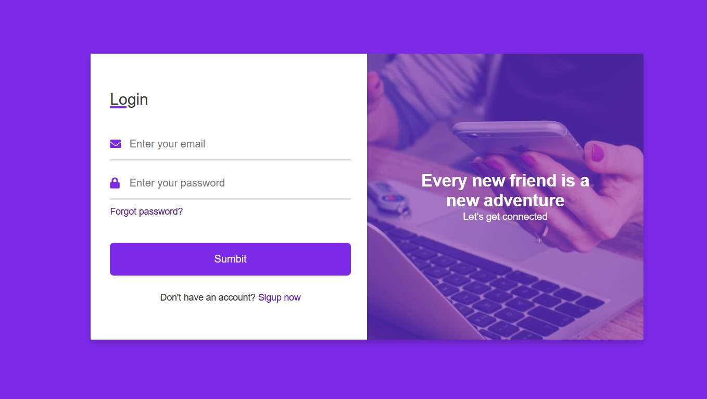
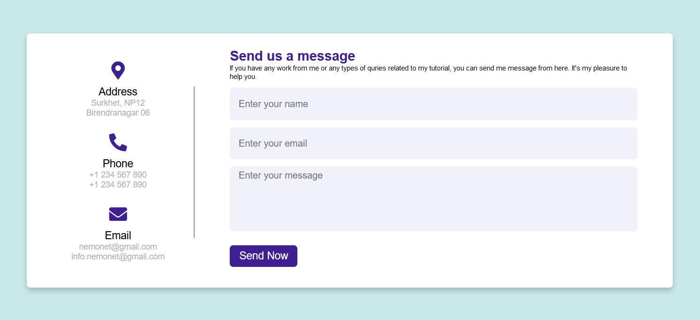
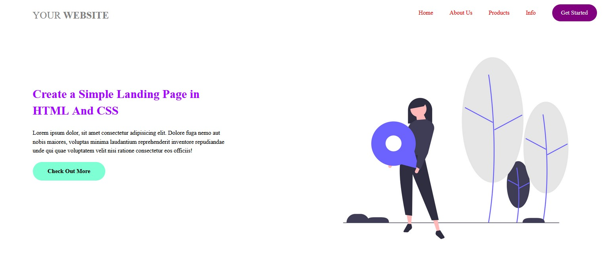

🙏 kindly follow and give a star 🙏  you can also fork this to contribute

# HTML And CSS Projects For Advance (With Source Code)

If you want to feel confident in your front-end web developer skills, the easiest solution is to start building your own HTML and CSS projects from scratch.

## Why build HTML and CSS projects?

Practicing on realistic, hands-on projects is the best way to learn how to create something useful and meaningful with HTML and CSS.

The more projects you finish, the more confidence you build.

## HTML and CSS projects: Table of contents

 [project: Login/Sign-Up](#project-loginsign-up)
 [project: Responsive Contact Us Form](#project-responsive-contact-us-form)
 [project: Simple Landing Page](#project-simple-landing-page)

---

### project: Login/Sign-Up

Hello friends, today we are going to learn How to Create a Responsive Login and Registration Form Template in HTML and CSS. There are a lot of Forms Design that I have created before but, to date, I have not created login and registration forms together or on one page.

[☝️ back to top ☝️](#html-and-css-projects-table-of-contents)      

---

### project: Responsive Contact Us Form

Hello friends, today we are going to create Responsive Contact Us Form or Page in HTML and CSS. There are many forms of design I  have created before as well as responsive contact us form. Today we will build something better than the previous.

[☝️ back to top ☝️](#html-and-css-projects-table-of-contents)

---

### project: Simple Landing Page

Every website needs a menu, right?

This hamburger menu is beautiful and clean, and you can build it with just HTML and CSS:

[☝️ back to top ☝️](#html-and-css-projects-table-of-contents)

---

🙏 kindly follow and give a star 🙏  you can also fork this to contribute

