# HTML And CSS Projects For Beginners (With Source Code)

If you want to feel confident in your front-end web developer skills, the easiest solution is to start building your own HTML and CSS projects from scratch.

## Why build HTML and CSS projects?

Practicing on realistic, hands-on projects is the best way to learn how to create something useful and meaningful with HTML and CSS.

The more projects you finish, the more confidence you build.

## HTML and CSS projects: Table of contents

 [Beginner project: CSS radio buttons](#beginner-project-css-radio-buttons)
 [Beginner project: CSS toggle buttons](#beginner-project-css-toggle-buttons)
 [Beginner project: Hamburger menu](#beginner-project-hamburger-menu)
 [Beginner project: Pure CSS sidebar toggle menu](#beginner-project-pure-css-sidebar-toggle-menu)
 [Beginner project: Animated CSS menu](#beginner-project-animated-css-menu)
 [Beginner project: Custom checkboxes](#beginner-project-custom-checkboxes)
 [Beginner project: Pure CSS select dropdown](#beginner-project-pure-css-select-dropdown)
 [Beginner project: Modal/Popup without JavaScript](#beginner-project-modalpopup-without-javascript)
 [Beginner project: Animated gradient ghost button](#beginner-project-animated-gradient-ghost-button)
 [Beginner project: CSS image slider](#beginner-project-css-image-slider)

---

### Beginner project: CSS radio buttons

This quick project is a great example of what you can do with pure CSS to style radio buttons or checkboxes:

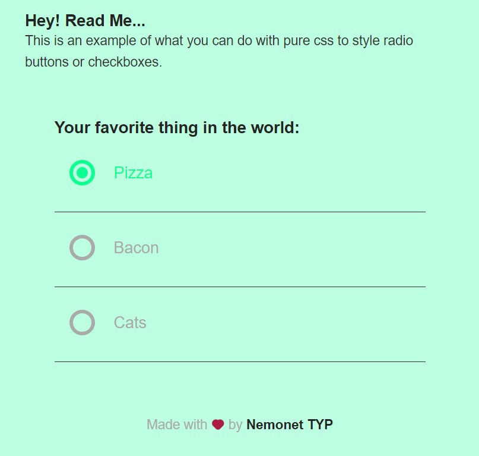

[☝️ back to top ☝️](#html-and-css-projects-table-of-contents)      

---

### Beginner project: CSS toggle buttons

This HTML and CSS project teaches you how to create custom CSS toggle buttons from scratch:

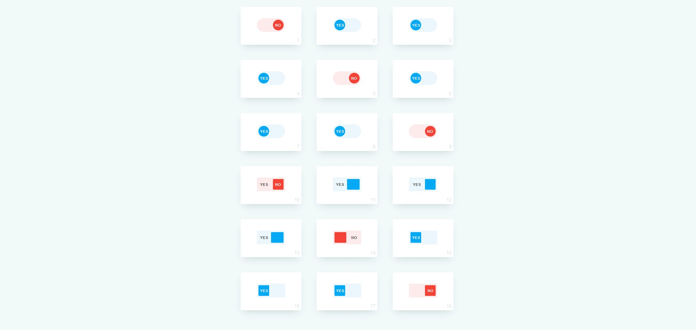

[☝️ back to top ☝️](#html-and-css-projects-table-of-contents)

---

### Beginner project: Hamburger menu

Every website needs a menu, right?

This hamburger menu is beautiful and clean, and you can build it with just HTML and CSS:

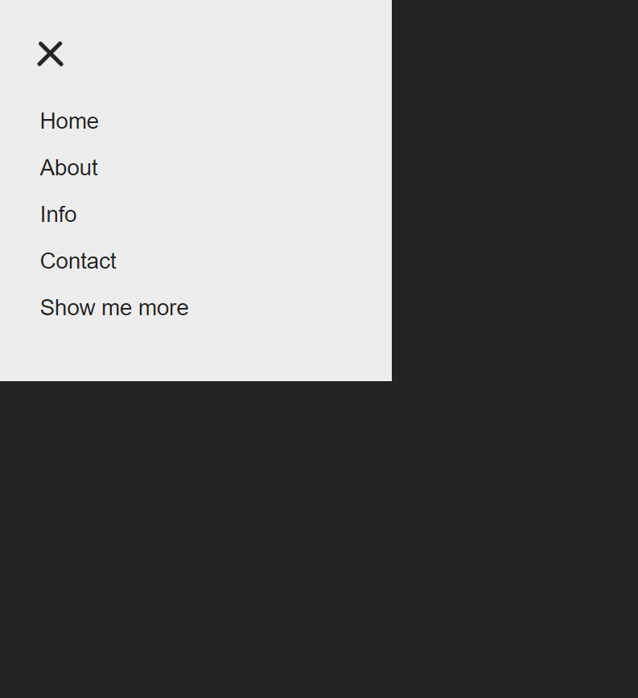

[☝️ back to top ☝️](#html-and-css-projects-table-of-contents)

---

### Beginner project: Pure CSS sidebar toggle menu

Placing your website navigation inside a sidebar toggle is an easy way to clean up the overall look and feel of your design.

Here’s a modern-looking solution to a pure-CSS sidebar toggle menu:

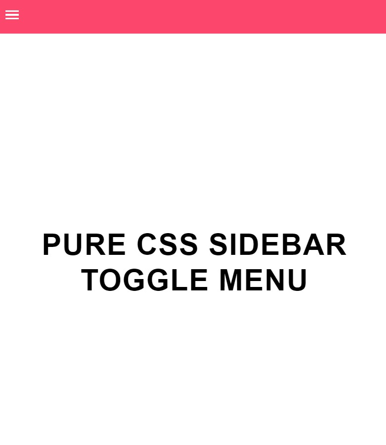 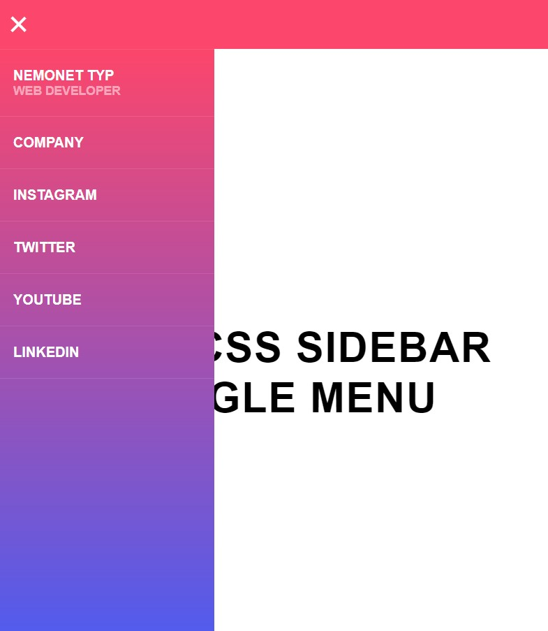

[☝️ back to top ☝️](#html-and-css-projects-table-of-contents)

---

### Beginner project: Animated CSS menu

If you want to build a more dynamic, interactive website navigation, try this animated CSS menu:

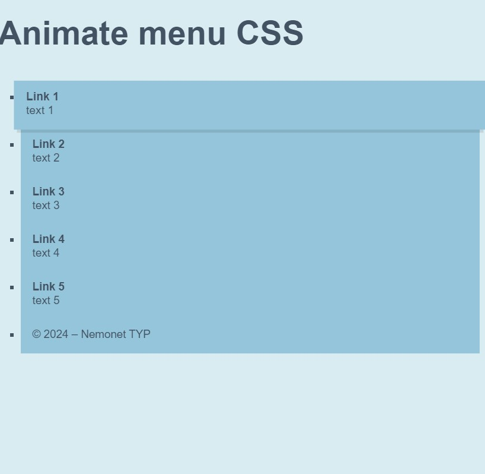

[☝️ back to top ☝️](#html-and-css-projects-table-of-contents)

 <a href="./Basic">Source Code</a>

---

### Beginner project: Custom checkboxes

Styling your checkboxes to match the overall design is an easy way to elevate the look and feel of your website.

Here’s an easy HTML and CSS practice project to achieve that:

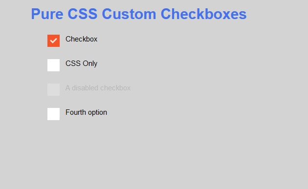

[☝️ back to top ☝️](#html-and-css-projects-table-of-contents)

 <a href="./Basic">Source Code</a>

---

### Beginner project: Pure CSS select dropdown

Standard select dropdowns often look dull and boring. Here’s a quick CSS project to learn how to create beautiful select dropdowns easily:

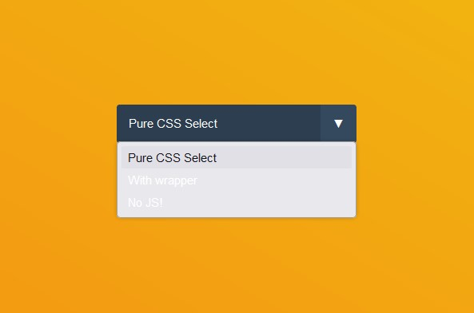

[☝️ back to top ☝️](#html-and-css-projects-table-of-contents)

 

---

### Beginner project: Modal/Popup without JavaScript

Modals and popups often use JavaScript, but here’s a pure HTML and CSS solution to creating dynamic, interactive modals and popups:

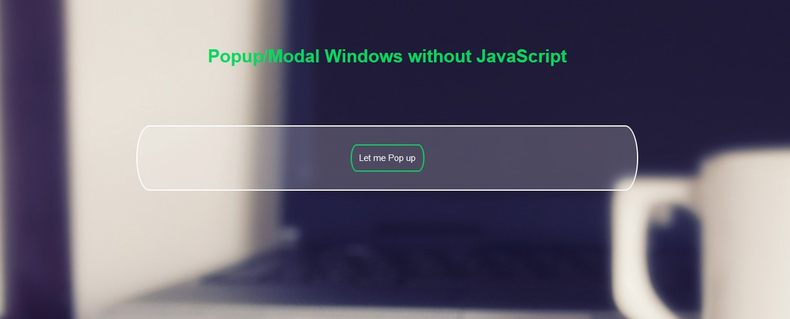

[☝️ back to top ☝️](#html-and-css-projects-table-of-contents)

---

### Beginner project: Animated gradient ghost button

Ghost buttons can look great if they fit the overall look and feel of your website.

Here’s an easy project to practice creating stunning, dynamic ghost buttons for your next website project:

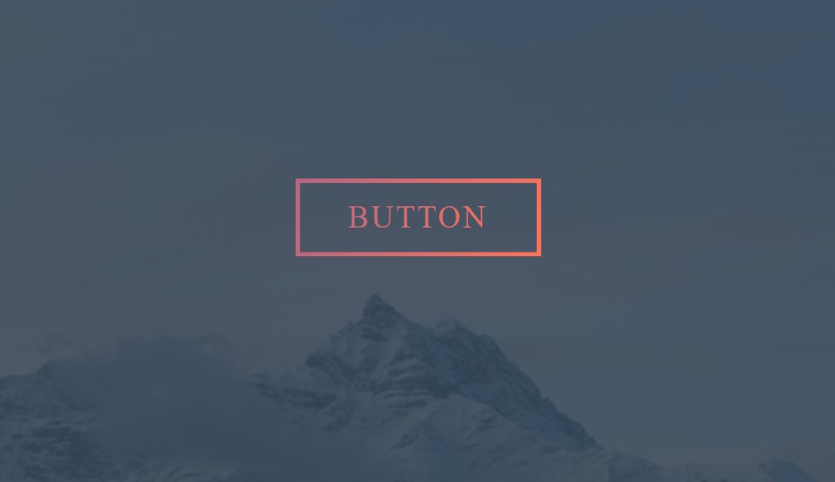

[☝️ back to top ☝️](#html-and-css-projects-table-of-contents)

---

### Beginner project: CSS image slider

This image slider with navigation buttons and dots is a fantastic HTML and CSS project to practice your front-end web development skills:

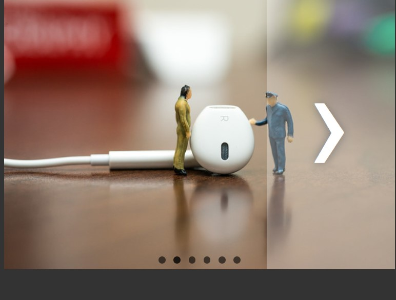

[☝️ back to top ☝️](#html-and-css-projects-table-of-contents)

