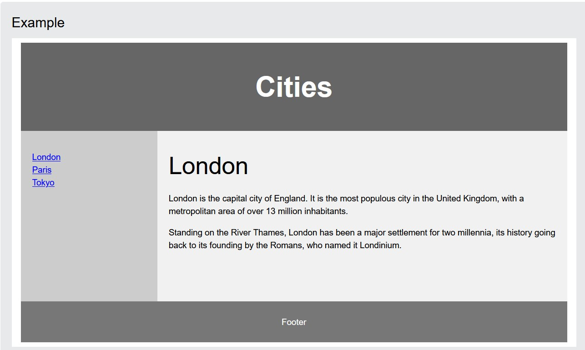
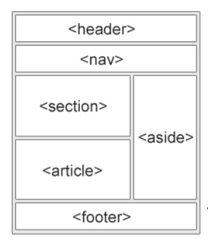
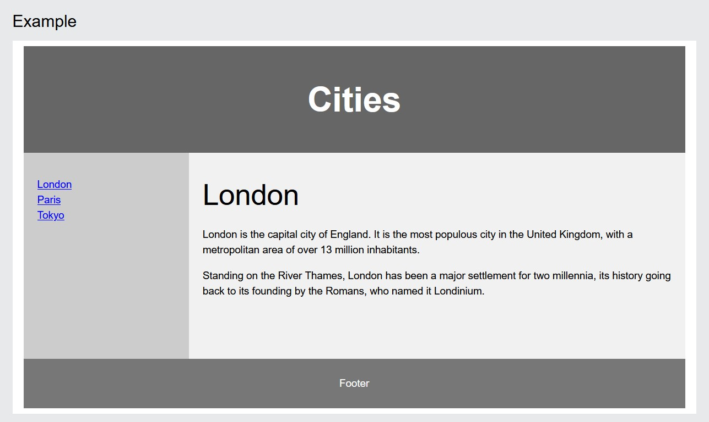
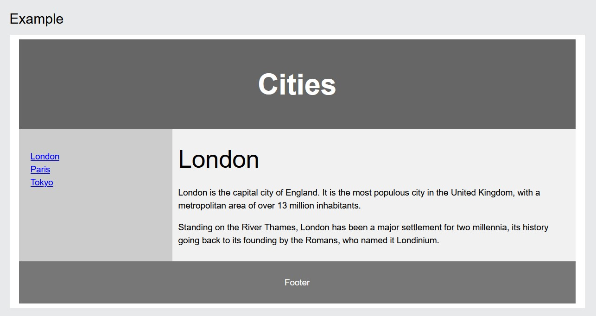

HTML+CSS Tutorial
=================


<details>
<summary> 4 W's </summary>

### Who

I'm Nemonet. I'm a Programmer and I've been teaching myself HTML, CSS, and other web development and scripting for over 4 years.
And I want to teach you now.
Because I feel like.
And because it's useful.

### What

In this tutorial, we'll start from the very beginning.  You don't need to know anything about HTML and CSS or anything about code to start.  I'll include some tutorial files for you to play with and check out.

### When

Now.  Or whenever.  I'm not planning on taking this down anytime soon rather than updating it constantly.  But you are only limited by your own schedule.  Or set free by it.  Whatever.

### Why

Because this stuff is important.  Whether you're a business person formatting your emails, an aspiring web designer wanting to get your feet wet, or just someone who is interested and hasn't tried any sort of coding, scripting, or programming before, **HTML and CSS are an essential part** of your learning curve.

</details>

<a name="README"></a>

## Table of Contents

<details>
<summary>HTML</summary>

**HTML Tutorial**
[HTML Introduction](#html-introduction)
[HTML Editors](#html-editors)
[HTML Basic](#html-basic-examples)
[HTML Elements](#html-elements)
[HTML Attributes](#html-attributes)
[HTML Headings](#html-headings-1)
[HTML Paragraphs](#html-paragraphs-1)
[HTML Styles](#html-styles)
[HTML Formatting](#html-text-formatting)
[HTML Quotations](#html-quotation-and-citation-elements)
[HTML Comments](#html-comments)
[HTML Colors](#html-colors)
[HTML CSS](#html-styles---css)
[HTML Links](#html-links)
[HTML Images](#html-images-1)
[HTML Favicon](#html-favicon)
[HTML Page Title](#html-page-title)
[HTML Tables](#html-tables)
[HTML Lists](#html-lists)
[HTML Block & Inline](#html-block-and-inline-elements)
[HTML Div](#html-div-element)
[HTML Classes](#html-class-attribute)
[HTML Id](#html-id-attribute)
[HTML Iframes](#html-iframes)
[HTML JavaScript](#html-javascript)
[HTML File Paths](#html-file-paths)
[HTML Head](#html---the-head-element)
[HTML Layout](#html-layout-elements-and-techniques)
[HTML Responsive](#html-responsive-web-design)
[HTML Computercode](#html-computer-code-elements)
[HTML Semantics](#html-semantic-elements)
[HTML Style Guide](#html-style-guide)
[HTML Entities](#html-entities)
[HTML Symbols](#html-symbols)
[HTML Emojis](#using-emojis-in-html)
[HTML Charsets](#html-encoding-character-sets)
[HTML URL Encode](#html-uniform-resource-locators)
[HTML vs. XHTML](#html-versus-xhtml)

**HTML Forms**
[HTML Forms]()
[HTML Form Attributes]()
[HTML Form Elements]()
[HTML Input Types]()
[HTML Input Attributes]()
[Input Form Attributes]()

**HTML Graphics**
[HTML Canvas]()
[HTML SVG]()

**HTML Media**
[HTML Media]()
[HTML Video]()
[HTML Audio]()
[HTML Plug-ins]()
[HTML YouTube]()

**HTML APIs**
[HTML Geolocation]()
[HTML Drag/Drop]()
[HTML Web Storage]()
[HTML Web Workers]()
[HTML SSE]()

**HTML Examples**
[HTML Examples]()
[HTML Editor]()
[HTML Quiz]()
[HTML Exercises]()
[HTML Website]()
[HTML Interview Prep]()
[HTML Bootcamp]()
[HTML Certificate]()
[HTML Summary]()
[HTML Accessibility]()

**HTML References**
[HTML Tag List]()
[HTML Attributes]()
[HTML Global Attributes]()
[HTML Browser Support]()
[HTML Events]()
[HTML Colors]()
[HTML Canvas]()
[HTML Audio/Video]()
[HTML Doctypes]()
[HTML Character Sets]()
[HTML URL Encode]()
[HTML Lang Codes]()
[HTTP Messages]()
[HTTP Methods]()
[PX to EM Converter]()
[Keyboard Shortcuts]()

</details>

<details>
<summary> CSS</summary>

 <a href="./CSS.md">CSS Tutorial</a>
  
</details>

- [Final Project!](https://github.com/The-Young-Programer/HTML-CSS-Tutorial/Projects)
- And now, the end is near

## HTML Time. Let's Go.

---

### HTML Introduction [⬆️](#table-of-contents)

HTML is the standard markup language for creating Web pages.

What is HTML?

  - HTML stands for Hyper Text Markup Language
  - HTML is the standard markup language for creating Web pages
  - HTML describes the structure of a Web page
  - HTML consists of a series of elements
  - HTML elements tell the browser how to display the content
  - HTML elements label pieces of content such as "this is a heading", "this is a paragraph", "this is a link", etc.

A Simple HTML Structure
  
   Example

  ```
		<!DOCTYPE html>
		<html>
		<head>
		<title>Page Title</title>
		</head>
		<body>

		<h1>My First Heading</h1>
		<p>My first paragraph.</p>

		</body>
		</html>
   ```

   Example Explained

   - The `<!DOCTYPE html>` declaration defines that this document is an HTML5 document
   - The `<html>` element is the root element of an HTML page
   - The `<head>` element contains meta information about the HTML page
   - The `<title>` element specifies a title for the HTML page (which is shown in the browser's title bar or in the page's tab)
   - The `<body>` element defines the document's body, and is a container for all the visible contents, such as headings, paragraphs, images, hyperlinks, tables, lists, etc.
   - The `<h1>` element defines a large heading
   - The `<p>` element defines a paragraph


What is an HTML Element?

  An HTML element is defined by a start tag, some content, and an end tag:
	`<tagname>` Content goes here... `</tagname>`

  - The HTML element is everything from the start tag to the end tag:
  
	`<h1>`My First Heading`</h1>`
	`<p>`My first paragraph.`</p>`


	| Start tag | Element content      | End tag   |
	|-----------|----------------------|-----------|
	| `<h1>`    | My First Heading      | `</h1>`   |
	| `<p>`     | My first paragraph.   | `</p>`    |
	| `<br>`    | none                  | none      |


	**Note:** Some HTML elements have no content (like the `<br>` element). These elements are called empty elements.
	Empty elements do not have an end tag!


HTML History

   Since the early days of the World Wide Web, there have been many versions of HTML:

   | Year | Version                                         |
   |------|-------------------------------------------------|
   | 1989 | Tim Berners-Lee invented www                    |
   | 1991 | Tim Berners-Lee invented HTML                   |
   | 1993 | Dave Raggett drafted HTML+                      |
   | 1995 | HTML Working Group defined HTML 2.0             |
   | 1997 | W3C Recommendation: HTML 3.2                   |
   | 1999 | W3C Recommendation: HTML 4.01                  |
   | 2000 | W3C Recommendation: XHTML 1.0                  |
   | 2008 | WHATWG HTML5 First Public Draft                 |
   | 2012 | WHATWG HTML5 Living Standard                    |
   | 2014 | W3C Recommendation: HTML5                      |
   | 2016 | W3C Candidate Recommendation: HTML 5.1         |
   | 2017 | W3C Recommendation: HTML5.1 2nd Edition         |
   | 2017 | W3C Recommendation: HTML5.2                    | 


---

### HTML Editors [⬆️](#table-of-contents)

So the first thing you'll need is an editor to edit your code. There's tons of options out there.

 - Notepad/TextEdit: This is about as basic as you can get. It's totally okay if you want to use this
 - Visual Studio Code: This is what I typically use. It's open source and has TONS of extensions available.
 - Sublime Text: This is a pretty popular option. Very clean interface.
 - CodePen Projects: This is an in-browser code editor, so you can code directly within the web browser, no downloads required.
 - Glitch: This is another in-browser code editor. It is meant for larger projects, but it's nice to not have to download anything!


Web pages can be created and modified by using professional HTML editors.

However, for learning HTML we recommend a simple text editor like Visual Studio Code

Follow the steps below to create your first web page with VS Code
  
  - Step 1: Open VS Code (PC)

	Then open a new document to place the code.


  - Step 2: Write Some HTML

	Write or copy the following HTML code into VsCode:

	```
		<!DOCTYPE html>
		<html>
		<body>

		<h1>My First Heading</h1>

		<p>My first paragraph.</p>

		</body>
		</html>
	```


  - Step 3: Save the HTML Page

	- Save the file on your computer. 

	- Name the file "index.html"

	- View in Browser

	Tip: You can use either .htm or .html as file extension. There is no difference; it is up to you.


  - Step 4: View the HTML Page in Your Browser

	- Open the saved HTML file in your favorite browser (double click on the file, or right-click - and choose "Open with").

	- The result will look much like this:

	<a name="README"></a>

	View in Browser

---


### HTML Basic Examples [⬆️](#table-of-contents)

In this chapter, we will show some basic HTML examples.  
Don't worry if we use tags you have not learned about yet.

#### HTML Documents

All HTML documents must start with a document type declaration: `<!DOCTYPE html>`.

The HTML document itself begins with `<html>` and ends with `</html>`.  
The visible part of the HTML document is between `<body>` and `</body>`.

##### Example:
```html
<!DOCTYPE html>
<html>
<body>

<h1>My First Heading</h1>
<p>My first paragraph.</p>

</body>
</html>
```


#### The `<!DOCTYPE>` Declaration

The `<!DOCTYPE>` declaration represents the document type and helps browsers display web pages correctly.  
It must only appear once, at the top of the page (before any HTML tags).  
The `<!DOCTYPE>` declaration is not case-sensitive.  
The `<!DOCTYPE>` declaration for HTML5 is:
```html
<!DOCTYPE html>
```


#### HTML Headings

HTML headings are defined with the `<h1>` to `<h6>` tags.  
`<h1>` defines the most important heading, and `<h6>` defines the least important heading.

##### Example:
```html
<h1>This is heading 1</h1>
<h2>This is heading 2</h2>
<h3>This is heading 3</h3>
```


#### HTML Paragraphs

HTML paragraphs are defined with the `<p>` tag.

##### Example:
```html
<p>This is a paragraph.</p>
<p>This is another paragraph.</p>
```


#### HTML Links

HTML links are defined with the `<a>` tag.

##### Example:
```html
<a href="https://www.nemonet.com">This is a link</a>
```

The link's destination is specified in the `href` attribute.  
Attributes are used to provide additional information about HTML elements.  
You will learn more about attributes in a later chapter.


#### HTML Images

HTML images are defined with the `` tag.  
The source file (`src`), alternative text (`alt`), width, and height are provided as attributes.

##### Example:
```html

```


#### How to View HTML Source

Have you ever seen a web page and wondered "Hey! How did they do that?"

##### View HTML Source Code:
- Click `CTRL + U` on an HTML page, or  
- Right-click on the page and select **"View Page Source"**.  
  This will open a new tab containing the HTML source code of the page.

##### Inspect an HTML Element:
- Right-click on an element (or a blank area) and choose **"Inspect"**.  
  This allows you to see both the HTML and the CSS.
- You can also edit the HTML or CSS on-the-fly in the **Elements** or **Styles** panel that opens.


---


### HTML Elements [⬆️](#table-of-contents)

An HTML element is defined by a start tag, some content, and an end tag.

#### HTML Elements

The HTML element is everything from the start tag to the end tag:

```html
<tagname>Content goes here...</tagname>
```

##### Examples of some HTML elements:
```html
<h1>My First Heading</h1>
<p>My first paragraph.</p>
```

| Start tag | Element content      | End tag            |
|-----------|----------------------|--------------------|
| `<h1>`    | My First Heading      | `</h1>`            |
| `<p>`     | My first paragraph.   | `</p>`             |
| `<br>`    | none                  | none               |

**Note**: Some HTML elements have no content (like the `<br>` element). These elements are called **empty elements**. Empty elements do not have an end tag!

#### Nested HTML Elements

HTML elements can be nested (this means that elements can contain other elements). All HTML documents consist of nested HTML elements.

The following example contains four HTML elements (`<html>`, `<body>`, `<h1>`, and `<p>`):

##### Example:
```html
<!DOCTYPE html>
<html>
<body>

<h1>My First Heading</h1>
<p>My first paragraph.</p>

</body>
</html>
```

##### Example Explained

- The `<html>` element is the root element and it defines the whole HTML document.
  - It has a start tag `<html>` and an end tag `</html>`.
  
- Then, inside the `<html>` element, there is a `<body>` element:
  ```html
  <body>
    <h1>My First Heading</h1>
    <p>My first paragraph.</p>
  </body>
  ```

  - The `<body>` element defines the document's body.
    - It has a start tag `<body>` and an end tag `</body>`.

- Inside the `<body>` element, there are two other elements: `<h1>` and `<p>`:
  ```html
  <h1>My First Heading</h1>
  <p>My first paragraph.</p>
  ```

  - The `<h1>` element defines a heading.
    - It has a start tag `<h1>` and an end tag `</h1>`:
      ```html
      <h1>My First Heading</h1>
      ```

  - The `<p>` element defines a paragraph.
    - It has a start tag `<p>` and an end tag `</p>`:
      ```html
      <p>My first paragraph.</p>
      ```

#### Never Skip the End Tag

Some HTML elements will display correctly, even if you forget the end tag:

##### Example:
```html
<html>
<body>

<p>This is a paragraph
<p>This is a paragraph

</body>
</html>
```

However, **never rely on this**! Unexpected results and errors may occur if you forget the end tag!

#### Empty HTML Elements

HTML elements with no content are called **empty elements**. The `<br>` tag defines a line break and is an empty element without a closing tag:

##### Example:
```html
<p>This is a <br> paragraph with a line break.</p>
```

#### HTML is Not Case Sensitive

HTML tags are not case sensitive: `<P>` means the same as `<p>`.

The HTML standard does not require lowercase tags, but W3C recommends lowercase in HTML and demands lowercase for stricter document types like XHTML.

---


### HTML Attributes [⬆️](#table-of-contents)

HTML attributes provide additional information about HTML elements.

#### HTML Attributes

- All HTML elements can have attributes
- Attributes provide additional information about elements
- Attributes are always specified in the start tag
- Attributes usually come in name/value pairs like: `name="value"`

#### The `href` Attribute

The `<a>` tag defines a hyperlink. The `href` attribute specifies the URL of the page the link goes to:

**Example:**

```html
<a href="https://www.nemonet.com">Visit nemonet</a>
```

You will learn more about links in our HTML Links chapter.

#### The `src` Attribute

The `` tag is used to embed an image in an HTML page. The `src` attribute specifies the path to the image to be displayed:

**Example:**

```html

```

There are two ways to specify the URL in the `src` attribute:

1. **Absolute URL** - Links to an external image that is hosted on another website. Example: `src="https://www.nemonet.com/images/img_girl.jpg"`.

   **Notes:** External images might be under copyright. If you do not get permission to use it, you may be in violation of copyright laws. In addition, you cannot control external images; it can suddenly be removed or changed.

2. **Relative URL** - Links to an image that is hosted within the website. Here, the URL does not include the domain name. If the URL begins without a slash, it will be relative to the current page. Example: `src="img_girl.jpg"`. If the URL begins with a slash, it will be relative to the domain. Example: `src="/images/img_girl.jpg"`.

   **Tip:** It is almost always best to use relative URLs. They will not break if you change domain.

#### The `width` and `height` Attributes

The `` tag should also contain the `width` and `height` attributes, which specify the width and height of the image (in pixels):

**Example:**

```html

```

#### The `alt` Attribute

The required `alt` attribute for the `` tag specifies an alternate text for an image if the image for some reason cannot be displayed. This can be due to a slow connection, an error in the `src` attribute, or if the user uses a screen reader.

**Example:**

```html

```

**Example:**

See what happens if we try to display an image that does not exist:

```html

```

You will learn more about images in our HTML Images chapter.

#### The `style` Attribute

The `style` attribute is used to add styles to an element, such as color, font, size, and more.

**Example:**

```html
<p style="color:red;">This is a red paragraph.</p>
```

You will learn more about styles in our HTML Styles chapter.

#### The `lang` Attribute

You should always include the `lang` attribute inside the `<html>` tag to declare the language of the Web page. This is meant to assist search engines and browsers.

The following example specifies English as the language:

```html
<!DOCTYPE html>
<html lang="en">
<body>
...
</body>
</html>
```

Country codes can also be added to the language code in the `lang` attribute. So, the first two characters define the language of the HTML page, and the last two characters define the country.

The following example specifies English as the language and United States as the country:

```html
<!DOCTYPE html>
<html lang="en-US">
<body>
...
</body>
</html>
```

You can see all the language codes in our HTML Language Code Reference.

#### The `title` Attribute

The `title` attribute defines some extra information about an element.

The value of the `title` attribute will be displayed as a tooltip when you mouse over the element:

**Example:**

```html
<p title="I'm a tooltip">This is a paragraph.</p>
```

#### We Suggest: Always Use Lowercase Attributes

The HTML standard does not require lowercase attribute names.

The `title` attribute (and all other attributes) can be written with uppercase or lowercase like `title` or `TITLE`.

However, W3C recommends lowercase attributes in HTML and demands lowercase attributes for stricter document types like XHTML.

At nemonet, we always use lowercase attribute names.

#### We Suggest: Always Quote Attribute Values

The HTML standard does not require quotes around attribute values.

However, W3C recommends quotes in HTML and demands quotes for stricter document types like XHTML.

**Good:**

```html
<a href="https://www.nemonet.com/html/">Visit our HTML tutorial</a>
```

**Bad:**

```html
<a href=https://www.nemonet.com/html/>Visit our HTML tutorial</a>
```

Sometimes you have to use quotes. This example will not display the `title` attribute correctly because it contains a space:

**Example:**

```html
<p title=About nemonet>
```

At nemonet, we always use quotes around attribute values.

#### Single or Double Quotes?

Double quotes around attribute values are the most common in HTML, but single quotes can also be used.

In some situations, when the attribute value itself contains double quotes, it is necessary to use single quotes:

```html
<p title='John "ShotGun" Nelson'>
```

Or vice versa:

```html
<p title="John 'ShotGun' Nelson">
```

#### Chapter Summary

- All HTML elements can have attributes
- The `href` attribute of `<a>` specifies the URL of the page the link goes to
- The `src` attribute of `` specifies the path to the image to be displayed
- The `width` and `height` attributes of `` provide size information for images
- The `alt` attribute of `` provides an alternate text for an image
- The `style` attribute is used to add styles to an element, such as color, font, size, and more
- The `lang` attribute of the `<html>` tag declares the language of the Web page
- The `title` attribute defines some extra information about an element

---


### HTML Headings [⬆️](#table-of-contents)

HTML headings are titles or subtitles that you want to display on a webpage.

##### Example:

- **Heading 1**
- **Heading 2**
- **Heading 3**
- **Heading 4**
- **Heading 5**
- **Heading 6**


#### HTML Headings

HTML headings are defined with the `<h1>` to `<h6>` tags.

- `<h1>` defines the most important heading.
- `<h6>` defines the least important heading.

##### Example:

```html
<h1>Heading 1</h1>
<h2>Heading 2</h2>
<h3>Heading 3</h3>
<h4>Heading 4</h4>
<h5>Heading 5</h6>
<h6>Heading 6</h6>
```

> **Note:** Browsers automatically add some white space (a margin) before and after a heading.


#### Headings Are Important

- **Search engines** use headings to index the structure and content of your web pages.
- Users often **skim** a page by its headings, so it's important to use them to show the document structure.

- `<h1>` headings should be used for **main headings**, followed by `<h2>` for subheadings, and then less important headings like `<h3>`, and so on.

> **Note:** Use HTML headings for headings only. Don't use headings to make text **BIG** or **bold**.


#### Bigger Headings

Each HTML heading has a default size, but you can customize the size with the `style` attribute, using the CSS `font-size` property.

##### Example:

```html
<h1 style="font-size:60px;">Heading 1</h1>
```

---


### HTML Paragraphs [⬆️](#table-of-contents)

A paragraph always starts on a new line, and is usually a block of text.

#### HTML Paragraphs

The HTML `<p>` element defines a paragraph.

A paragraph always starts on a new line, and browsers automatically add some white space (a margin) before and after a paragraph.

##### Example
```html
<p>This is a paragraph.</p>
<p>This is another paragraph.</p>
```


#### HTML Display

You cannot be sure how HTML will be displayed.

Large or small screens, and resized windows will create different results.

With HTML, you cannot change the display by adding extra spaces or extra lines in your HTML code.

The browser will automatically remove any extra spaces and lines when the page is displayed:

##### Example
```html
<p>
  This paragraph
  contains a lot of lines
  in the source code,
  but the browser
  ignores it.
</p>

<p>
  This paragraph
  contains         a lot of spaces
  in the source         code,
  but the        browser
  ignores it.
</p>
```


#### HTML Horizontal Rules

The `<hr>` tag defines a thematic break in an HTML page, and is most often displayed as a horizontal rule.

The `<hr>` element is used to separate content (or define a change) in an HTML page:

##### Example
```html
<h1>This is heading 1</h1>
<p>This is some text.</p>
<hr>
<h2>This is heading 2</h2>
<p>This is some other text.</p>
<hr>
```

The `<hr>` tag is an empty tag, which means that it has no end tag.


#### HTML Line Breaks

The HTML `<br>` element defines a line break.

Use `<br>` if you want a line break (a new line) without starting a new paragraph:

##### Example
```html
<p>This is<br>a paragraph<br>with line breaks.</p>
```

The `<br>` tag is an empty tag, which means that it has no end tag.


#### The Poem Problem

This poem will display on a single line:

##### Example
```html
<p>
  My Bonnie lies over the ocean.

  My Bonnie lies over the sea.

  My Bonnie lies over the ocean.

  Oh, bring back my Bonnie to me.
</p>
```


#### Solution - The HTML `<pre>` Element

The HTML `<pre>` element defines preformatted text.

The text inside a `<pre>` element is displayed in a fixed-width font (usually Courier), and it preserves both spaces and line breaks:

##### Example
```html
<pre>
  My Bonnie lies over the ocean.

  My Bonnie lies over the sea.

  My Bonnie lies over the ocean.

  Oh, bring back my Bonnie to me.
</pre>
```

---


### HTML Styles [⬆️](#table-of-contents)

 The HTML style attribute is used to add styles to an element, such as color, font, size, and more.

##### Example

`<p style="color:red;">I am Red</p>`

`<p style="color:blue;">I am Blue</p>`

`<p style="font-size:300%;">I am Big</p>`


##### The HTML Style Attribute

Setting the style of an HTML element can be done with the `style` attribute.

The HTML `style` attribute has the following syntax:
```
<tagname style="property:value;">
```

- The **property** is a CSS property.
- The **value** is a CSS value.

*You will learn more about CSS later in this tutorial.*


#### Background Color

The CSS `background-color` property defines the background color for an HTML element.

##### Example

Set the background color for a page to powderblue:

```
<body style="background-color:powderblue;">
  <h1>This is a heading</h1>
  <p>This is a paragraph.</p>
</body>
```

##### Example

Set background color for two different elements:

```
<body>
  <h1 style="background-color:powderblue;">This is a heading</h1>
  <p style="background-color:tomato;">This is a paragraph.</p>
</body>
```


#### Text Color

The CSS `color` property defines the text color for an HTML element:

##### Example

```
<h1 style="color:blue;">This is a heading</h1>
<p style="color:red;">This is a paragraph.</p>
```


#### Fonts

The CSS `font-family` property defines the font to be used for an HTML element:

##### Example

```
<h1 style="font-family:verdana;">This is a heading</h1>
<p style="font-family:courier;">This is a paragraph.</p>
```


#### Text Size

The CSS `font-size` property defines the text size for an HTML element:

##### Example

```
<h1 style="font-size:300%;">This is a heading</h1>
<p style="font-size:160%;">This is a paragraph.</p>
```


#### Text Alignment

The CSS `text-align` property defines the horizontal text alignment for an HTML element:

##### Example

```
<h1 style="text-align:center;">Centered Heading</h1>
<p style="text-align:center;">Centered paragraph.</p>
```


#### Chapter Summary

- Use the `style` attribute for styling HTML elements.
- Use `background-color` for background color.
- Use `color` for text colors.
- Use `font-family` for text fonts.
- Use `font-size` for text sizes.
- Use `text-align` for text alignment.

---

### HTML Text Formatting [⬆️](#table-of-contents)

HTML contains several elements for defining text with special meaning.

##### Example

**This text is bold**  
*This text is italic*  
This is _subscript_ and ^superscript^


#### HTML Formatting Elements

Formatting elements are designed to display special types of text:

- `<b>` - **Bold text**
- `<strong>` - **Important text**
- `<i>` - *Italic text*
- `<em>` - *Emphasized text*
- `<mark>` - Marked text
- `<small>` - Smaller text
- `<del>` - ~~Deleted text~~
- `<ins>` - Inserted text
- `<sub>` - Subscript text
- `<sup>` - Superscript text


#### HTML `<b>` and `<strong>` Elements

The HTML `<b>` element defines bold text, without any extra importance.

##### Example:
```html
<b>This text is bold</b>
```

The HTML `<strong>` element defines text with strong importance. The content inside is typically displayed in bold.

##### Example:
```html
<strong>This text is important!</strong>
```


#### HTML `<i>` and `<em>` Elements

The HTML `<i>` element defines a part of the text in an alternate voice or mood. The content inside is typically displayed in italic.

**Tip:** The `<i>` tag is often used to indicate a technical term, a phrase from another language, a thought, a ship name, etc.

##### Example:
```html
<i>This text is italic</i>
```

The HTML `<em>` element defines emphasized text. The content inside is typically displayed in italic.

**Tip:** A screen reader will pronounce the words in `<em>` with an emphasis, using verbal stress.

##### Example:
```html
<em>This text is emphasized</em>
```


#### HTML `<small>` Element

The HTML `<small>` element defines smaller text:

##### Example:
```html
<small>This is some smaller text.</small>
```


#### HTML `<mark>` Element

The HTML `<mark>` element defines text that should be marked or highlighted:

##### Example:
```html
<p>Do not forget to buy <mark>milk</mark> today.</p>
```


#### HTML `<del>` Element

The HTML `<del>` element defines text that has been deleted from a document. Browsers will usually strike through deleted text:

##### Example:
```html
<p>My favorite color is <del>blue</del> red.</p>
```


#### HTML `<ins>` Element

The HTML `<ins>` element defines text that has been inserted into a document. Browsers will usually underline inserted text:

##### Example:
```html
<p>My favorite color is <del>blue</del> <ins>red</ins>.</p>
```


#### HTML `<sub>` Element

The HTML `<sub>` element defines subscript text. Subscript text appears half a character below the normal line and is sometimes rendered in a smaller font. It can be used for chemical formulas like H₂O.

##### Example:
```html
<p>This is <sub>subscripted</sub> text.</p>
```


#### HTML `<sup>` Element

The HTML `<sup>` element defines superscript text. Superscript text appears half a character above the normal line and is sometimes rendered in a smaller font. It can be used for footnotes like WWW[1].

##### Example:
```html
<p>This is <sup>superscripted</sup> text.</p>
```


#### HTML Text Formatting Elements

| Tag        | Description                                       |
|------------|---------------------------------------------------|
| `<b>`      | Defines bold text                                 |
| `<em>`     | Defines emphasized text                           |
| `<i>`      | Defines a part of text in an alternate voice/mood |
| `<small>`  | Defines smaller text                              |
| `<strong>` | Defines important text                            |
| `<sub>`    | Defines subscript text                            |
| `<sup>`    | Defines superscript text                          |
| `<ins>`    | Defines inserted text                             |
| `<del>`    | Defines deleted text                              |
| `<mark>`   | Defines marked/highlighted text                   |


For a complete list of all available HTML tags, visit our [HTML Tag Reference](#).

---


### HTML Quotation and Citation Elements [⬆️](#table-of-contents)

In this chapter, we will go through the `<blockquote>`, `<q>`, `<abbr>`, `<address>`, `<cite>`, and `<bdo>` HTML elements.

#### Example

Here is a quote from WWF's website:

> For 60 years, WWF has worked to help people and nature thrive. As the world's leading conservation organization, WWF works in nearly 100 countries. At every level, we collaborate with people around the world to develop and deliver innovative solutions that protect communities, wildlife, and the places in which they live.


#### HTML `<blockquote>` for Quotations

The HTML `<blockquote>` element defines a section that is quoted from another source.

Browsers usually indent `<blockquote>` elements.

##### Example
```html
<p>Here is a quote from WWF's website:</p>
<blockquote cite="http://www.worldwildlife.org/who/index.html">
For 60 years, WWF has worked to help people and nature thrive. As the world's leading conservation organization, WWF works in nearly 100 countries. At every level, we collaborate with people around the world to develop and deliver innovative solutions that protect communities, wildlife, and the places in which they live.
</blockquote>
```


#### HTML `<q>` for Short Quotations

The HTML `<q>` tag defines a short quotation.

Browsers normally insert quotation marks around the quotation.

##### Example
```html
<p>WWF's goal is to: <q>Build a future where people live in harmony with nature.</q></p>
```


#### HTML `<abbr>` for Abbreviations

The HTML `<abbr>` tag defines an abbreviation or acronym, like "HTML", "CSS", "Mr.", "Dr.", "ASAP", "ATM".

Marking abbreviations can provide useful information to browsers, translation systems, and search engines.

**Tip:** Use the global `title` attribute to show the description for the abbreviation/acronym when you mouse over the element.

##### Example
```html
<p>The <abbr title="World Health Organization">WHO</abbr> was founded in 1948.</p>
```


#### HTML `<address>` for Contact Information

The HTML `<address>` tag defines the contact information for the author/owner of a document or article. This can be an email address, URL, physical address, phone number, or social media handle.

The text in the `<address>` element usually renders in *italic*, and browsers will add a line break before and after the element.

##### Example
```html
<address>
  Written by John Doe.<br>
  Visit us at:<br>
  Example.com<br>
  Box 564, Disneyland<br>
  USA
</address>
```


#### HTML `<cite>` for Work Title

The HTML `<cite>` tag defines the title of a creative work, such as a book, poem, song, movie, or painting.

**Note:** A person's name is *not* the title of a work.

The text in the `<cite>` element usually renders in *italic*.

##### Example
```html
<p><cite>The Scream</cite> by Edvard Munch. Painted in 1893.</p>
```


#### HTML `<bdo>` for Bi-Directional Override

`BDO` stands for *Bi-Directional Override*.

The HTML `<bdo>` tag is used to override the current text direction.

##### Example
```html
<bdo dir="rtl">This text will be written from right to left</bdo>
```


#### HTML Exercises

##### Test Yourself With Exercises

**Exercise:**

Use an HTML element to add quotation marks around the word "cool".

```html
<p>I am so <q>cool</q>.</p>
```


#### HTML Quotation and Citation Elements Summary

| Tag         | Description                                                   |
|-------------|---------------------------------------------------------------|
| `<abbr>`    | Defines an abbreviation or acronym                             |
| `<address>` | Defines contact information for the author/owner of a document |
| `<bdo>`     | Defines the text direction                                     |
| `<blockquote>` | Defines a section that is quoted from another source        |
| `<cite>`    | Defines the title of a work                                    |
| `<q>`       | Defines a short inline quotation                               |

For a complete list of all available HTML tags, visit our [HTML Tag Reference](#).


---


### HTML Comments [⬆️](#table-of-contents)

HTML comments are not displayed in the browser, but they can help document your HTML source code.

#### HTML Comment Tag

You can add comments to your HTML source by using the following syntax:

```
<!-- Write your comments here -->
```

Notice that there is an exclamation point `(!)` in the start tag, but not in the end tag.

> **Note:** Comments are not displayed by the browser, but they can help document your HTML source code.

#### Add Comments

With comments, you can place notifications and reminders in your HTML code.

**Example**:

```
<!-- This is a comment -->

<p>This is a paragraph.</p>

<!-- Remember to add more information here -->
```

#### Hide Content

Comments can be used to hide content. This can be helpful if you hide content temporarily.

**Example**:

```
<p>This is a paragraph.</p>

<!-- <p>This is another paragraph.</p> -->

<p>This is a paragraph too.</p>
```

You can also hide more than one line. Everything between the `<!--` and the `-->` will be hidden from the display.

**Example**: Hide a section of HTML code:

```
<p>This is a paragraph.</p>
<!--
<p>Look at this cool image:</p>

-->
<p>This is a paragraph too.</p>
```

Comments are also great for debugging HTML because you can comment out HTML lines of code one at a time to search for errors.

#### Hide Inline Content

Comments can be used to hide parts in the middle of the HTML code.

**Example**: Hide a part of a paragraph:

```
<p>This <!-- great text --> is a paragraph.</p> 
```

---


### HTML Colors [⬆️](#table-of-contents)

HTML colors are specified with **predefined color names**, or with **RGB, HEX, HSL, RGBA**, or **HSLA** values.

#### Color Names

In HTML, a color can be specified by using a **color name**:

- Tomato
- Orange
- DodgerBlue
- MediumSeaGreen
- Gray
- SlateBlue
- Violet
- LightGray

HTML supports **140 standard color names**.

#### Background Color

You can set the background color for HTML elements:

```html
<h1 style="background-color:DodgerBlue;">Hello World</h1>
<p style="background-color:Tomato;">Lorem ipsum...</p>
```

**Example:**
```html
<h1 style="background-color:DodgerBlue;">Hello World</h1>
<p style="background-color:Tomato;">
  Lorem ipsum dolor sit amet, consectetuer adipiscing elit, 
  sed diam nonummy nibh euismod tincidunt ut laoreet dolore 
  magna aliquam erat volutpat.
</p>
```


#### Text Color

You can set the color of text:

```html
<h1 style="color:Tomato;">Hello World</h1>
<p style="color:DodgerBlue;">Lorem ipsum...</p>
<p style="color:MediumSeaGreen;">Ut wisi enim...</p>
```

**Example:**
```html
<h1 style="color:Tomato;">Hello World</h1>
<p style="color:DodgerBlue;">
  Lorem ipsum dolor sit amet, consectetuer adipiscing elit, 
  sed diam nonummy nibh euismod tincidunt ut laoreet dolore 
  magna aliquam erat volutpat.
</p>
<p style="color:MediumSeaGreen;">
  Ut wisi enim ad minim veniam, quis nostrud exerci tation 
  ullamcorper suscipit lobortis nisl ut aliquip ex ea commodo consequat.
</p>
```


#### Border Color

You can set the color of borders:

```html
<h1 style="border:2px solid Tomato;">Hello World</h1>
<h1 style="border:2px solid DodgerBlue;">Hello World</h1>
<h1 style="border:2px solid Violet;">Hello World</h1>
```

**Example:**
```html
<h1 style="border:2px solid Tomato;">Hello World</h1>
<h1 style="border:2px solid DodgerBlue;">Hello World</h1>
<h1 style="border:2px solid Violet;">Hello World</h1>
```


#### Color Values

In HTML, colors can also be specified using **RGB values**, **HEX values**, **HSL values**, **RGBA values**, and **HSLA values**.

The following `<div>` elements have their background color set with RGB, HEX, and HSL values:

- **RGB:** `rgb(255, 99, 71)`
- **HEX:** `#ff6347`
- **HSL:** `hsl(9, 100%, 64%)`

The following elements have their background color set with RGBA and HSLA values, adding **50% transparency**:

- **RGBA:** `rgba(255, 99, 71, 0.5)`
- **HSLA:** `hsla(9, 100%, 64%, 0.5)`

**Example:**
```html
<h1 style="background-color:rgb(255, 99, 71);">...</h1>
<h1 style="background-color:#ff6347;">...</h1>
<h1 style="background-color:hsl(9, 100%, 64%);">...</h1>

<h1 style="background-color:rgba(255, 99, 71, 0.5);">...</h1>
<h1 style="background-color:hsla(9, 100%, 64%, 0.5);">...</h1>
```


### HTML RGB and RGBA Colors

An **RGB color value** represents **RED**, **GREEN**, and **BLUE** light sources.

An **RGBA color value** is an extension of RGB with an **Alpha channel** (opacity).


#### RGB Color Values

In HTML, a color can be specified as an **RGB value**, using this formula:

`rgb(red, green, blue)`

Each parameter (**red**, **green**, and **blue**) defines the intensity of the color with a value between **0 and 255**.

This means that there are **256 x 256 x 256 = 16777216 possible colors**!

##### Examples:

- `rgb(255, 0, 0)` is displayed as **red**, because red is set to its highest value (**255**), and the other two (green and blue) are set to **0**.
  
- `rgb(0, 255, 0)` is displayed as **green**, because green is set to its highest value (**255**), and the other two (red and blue) are set to **0**.

- To display **black**, set all color parameters to **0**, like this:  
  `rgb(0, 0, 0)`.

- To display **white**, set all color parameters to **255**, like this:  
  `rgb(255, 255, 255)`.


##### Experiment by mixing the RGB values below:

- `rgb(255, 68, 25)`

| Component | Value |
| --------- | ----- |
| **RED**   | 255   |
| **GREEN** | 68    |
| **BLUE**  | 25    |


##### Other examples:

- `rgb(255, 0, 0)`
- `rgb(0, 0, 255)`
- `rgb(60, 179, 113)`
- `rgb(238, 130, 238)`
- `rgb(255, 165, 0)`
- `rgb(106, 90, 205)`


#### Shades of Gray

Shades of gray are often defined using **equal values** for all three parameters.

##### Examples:

- `rgb(60, 60, 60)`
- `rgb(100, 100, 100)`
- `rgb(140, 140, 140)`
- `rgb(180, 180, 180)`
- `rgb(200, 200, 200)`
- `rgb(240, 240, 240)`


#### RGBA Color Values

**RGBA color values** are an extension of **RGB** color values with an **Alpha channel** – which specifies the **opacity** for a color.

An **RGBA color value** is specified with:

`rgba(red, green, blue, alpha)`

The **alpha** parameter is a number between **0.0** (fully transparent) and **1.0** (not transparent at all).


##### Experiment by mixing the RGBA values below:

- `rgba(255, 99, 71, 0.5)`

| Component | Value |
| --------- | ----- |
| **RED**   | 255   |
| **GREEN** | 99    |
| **BLUE**  | 71    |
| **ALPHA** | 0.5   |


### Other examples:

- `rgba(255, 99, 71, 0)`
- `rgba(255, 99, 71, 0.2)`
- `rgba(255, 99, 71, 0.4)`
- `rgba(255, 99, 71, 0.6)`
- `rgba(255, 99, 71, 0.8)`
- `rgba(255, 99, 71, 1)`


### HTML HEX Colors

A hexadecimal color is specified with: `#RRGGBB`, where the **RR** (red), **GG** (green), and **BB** (blue) hexadecimal integers specify the components of the color.

##### HEX Color Values

In HTML, a color can be specified using a hexadecimal value in the form:

`#rrggbb`

Where **rr** (red), **gg** (green), and **bb** (blue) are hexadecimal values between `00` and `ff` (same as decimal `0-255`).

For example, `#ff0000` is displayed as **red**, because red is set to its highest value (`ff`), and the other two (green and blue) are set to `00`.

Another example, `#00ff00` is displayed as **green**, because green is set to its highest value (`ff`), and the other two (red and blue) are set to `00`.

To display **black**, set all color parameters to `00`, like this: `#000000`.

To display **white**, set all color parameters to `ff`, like this: `#ffffff`.

##### Experiment by mixing the HEX values below:

`#ff6347`

- **RED**: ff
- **GREEN**: 63
- **BLUE**: 47

##### Example

- `#ff0000`
- `#0000ff`
- `#3cb371`
- `#ee82ee`
- `#ffa500`
- `#6a5acd`

##### Shades of Gray

Shades of gray are often defined using equal values for all three parameters:

##### Example

- `#404040`
- `#686868`
- `#a0a0a0`
- `#bebebe`
- `#dcdcdc`
- `#f8f8f8`


### HTML HSL and HSLA Colors

**HSL** stands for hue, saturation, and lightness.

**HSLA** color values are an extension of HSL with an Alpha channel (opacity).


#### HSL Color Values

In HTML, a color can be specified using **hue**, **saturation**, and **lightness** (HSL) in the form:

`hsl(hue, saturation, lightness)`

- **Hue** is a degree on the color wheel from 0 to 360. 
  - 0 is red, 120 is green, and 240 is blue.
- **Saturation** is a percentage value. 
  - 0% means a shade of gray, and 100% is the full color.
- **Lightness** is also a percentage value. 
  - 0% is black, and 100% is white.

##### Experiment by mixing the HSL values below:

`hsl(0, 100%, 50%)`

- **HUE:** 0
- **SATURATION:** 100%
- **LIGHTNESS:** 50%

##### Example:

```css
hsl(0, 100%, 50%);
hsl(240, 100%, 50%);
hsl(147, 50%, 47%);
hsl(300, 76%, 72%);
hsl(39, 100%, 50%);
hsl(248, 53%, 58%);
```


#### Saturation

**Saturation** can be described as the intensity of a color.

- **100%** is pure color, no shades of gray.
- **50%** is 50% gray, but you can still see the color.
- **0%** is completely gray; you can no longer see the color.

##### Example:

```css
hsl(0, 100%, 50%);
hsl(0, 80%, 50%);
hsl(0, 60%, 50%);
hsl(0, 40%, 50%);
hsl(0, 20%, 50%);
hsl(0, 0%, 50%);
```


#### Lightness

The **lightness** of a color can be described as how much light you want to give the color:
- **0%** means no light (black).
- **50%** means 50% light (neither dark nor light).
- **100%** means full lightness (white).

##### Example:

```css
hsl(0, 100%, 0%);
hsl(0, 100%, 25%);
hsl(0, 100%, 50%);
hsl(0, 100%, 75%);
hsl(0, 100%, 90%);
hsl(0, 100%, 100%);
```


#### Shades of Gray

Shades of gray are often defined by setting the **hue** and **saturation** to 0, and adjusting the **lightness** from 0% to 100% to get darker/lighter shades.

##### Example:

```css
hsl(0, 0%, 20%);
hsl(0, 0%, 30%);
hsl(0, 0%, 40%);
hsl(0, 0%, 60%);
hsl(0, 0%, 70%);
hsl(0, 0%, 90%);
```


### HSLA Color Values

**HSLA** color values are an extension of **HSL** color values, with an **Alpha channel** - which specifies the opacity for a color.

An HSLA color value is specified with:

`hsla(hue, saturation, lightness, alpha)`

The **alpha** parameter is a number between 0.0 (fully transparent) and 1.0 (not transparent at all):

##### Experiment by mixing the HSLA values below:

`hsla(0, 100%, 50%, 0.5)`

- **HUE:** 0
- **SATURATION:** 100%
- **LIGHTNESS:** 50%
- **ALPHA:** 0.5

##### Example:

```css
hsla(9, 100%, 64%, 0);
hsla(9, 100%, 64%, 0.2);
hsla(9, 100%, 64%, 0.4);
hsla(9, 100%, 64%, 0.6);
hsla(9, 100%, 64%, 0.8);
hsla(9, 100%, 64%, 1);
```

---


### HTML Styles - CSS [⬆️](#table-of-contents)

**CSS** stands for Cascading Style Sheets.

CSS saves a lot of work. It can control the layout of multiple web pages all at once.

##### CSS = Styles and Colors
- Manipulate Text
- Colors, Boxes


#### What is CSS?

Cascading Style Sheets (CSS) is used to format the layout of a webpage.

With CSS, you can control:
- Color
- Font
- Size of text
- Spacing between elements
- Element positioning
- Background images or colors
- Different displays for devices and screen sizes
- Much more!

**Tip:** The word *cascading* means that a style applied to a parent element will apply to all child elements. For example, if you set the body text color to "blue," all headings, paragraphs, and other text within the body will also be blue (unless you specify otherwise).


#### Using CSS

CSS can be added to HTML documents in 3 ways:

1. **Inline** - by using the `style` attribute inside HTML elements
2. **Internal** - by using a `<style>` element in the `<head>` section
3. **External** - by linking to an external CSS file using a `<link>` element

**Note:** The most common way to add CSS is by linking to an external file. However, in this tutorial, we will use inline and internal styles for easier demonstration.


##### Inline CSS

An inline CSS applies a unique style to a single HTML element, using the `style` attribute of that element.

**Example:**
```html
<h1 style="color:blue;">A Blue Heading</h1>
<p style="color:red;">A red paragraph.</p>
```


##### Internal CSS

Internal CSS defines styles for a single HTML page. It's placed within the `<head>` section inside a `<style>` element.

**Example:**
```html
<!DOCTYPE html>
<html>
<head>
  <style>
    body {background-color: powderblue;}
    h1 {color: blue;}
    p {color: red;}
  </style>
</head>
<body>
  <h1>This is a heading</h1>
  <p>This is a paragraph.</p>
</body>
</html>
```


##### External CSS

External style sheets define the style for many HTML pages. Add a link to the external CSS file in the `<head>` section of each page.

**Example:**
```html
<!DOCTYPE html>
<html>
<head>
  <link rel="stylesheet" href="styles.css">
</head>
<body>
  <h1>This is a heading</h1>
  <p>This is a paragraph.</p>
</body>
</html>
```

The external CSS file (e.g., "styles.css") should be saved without any HTML code. Here’s how it could look:

**styles.css:**
```css
body {
  background-color: powderblue;
}
h1 {
  color: blue;
}
p {
  color: red;
}
```

**Tip:** With an external CSS file, you can change the look of an entire website by modifying just one file!


#### CSS Colors, Fonts, and Sizes

Here’s a demonstration of some commonly used CSS properties: color, font-family, and font-size.

**Example:**
```html
<!DOCTYPE html>
<html>
<head>
  <style>
    h1 {
      color: blue;
      font-family: verdana;
      font-size: 300%;
    }
    p {
      color: red;
      font-family: courier;
      font-size: 160%;
    }
  </style>
</head>
<body>
  <h1>This is a heading</h1>
  <p>This is a paragraph.</p>
</body>
</html>
```


#### CSS Border

The CSS `border` property defines a border around an HTML element.

**Example:**
```css
p {
  border: 2px solid powderblue;
}
```


#### CSS Padding

The CSS `padding` property defines the space between the text and the border.

**Example:**
```css
p {
  border: 2px solid powderblue;
  padding: 30px;
}
```


#### CSS Margin

The CSS `margin` property defines the space outside the border.

**Example:**
```css
p {
  border: 2px solid powderblue;
  margin: 50px;
}
```


#### Link to External CSS

You can reference external style sheets using a full URL or a relative path.

**Example with Full URL:**
```html
<link rel="stylesheet" href="https://www.nemonet.com/html/styles.css">
```

**Example with Relative Path (html folder):**
```html
<link rel="stylesheet" href="/html/styles.css">
```

**Example with Relative Path (same folder):**
```html
<link rel="stylesheet" href="styles.css">
```

For more on file paths, check out the HTML File Paths chapter.


#### Chapter Summary:

- Use the `style` attribute for inline CSS
- Use the `<style>` element for internal CSS
- Use the `<link>` element for external CSS
- Use the CSS `color` property for text colors
- Use the CSS `font-family` property for fonts
- Use the CSS `font-size` property for text size
- Use the CSS `border` property for borders
- Use the CSS `padding` property for space inside borders
- Use the CSS `margin` property for space outside borders

**Tip:** You can learn much more about CSS in our [CSS Tutorial](#css).

---


### HTML Links [⬆️](#table-of-contents)

Links are found in nearly all web pages. Links allow users to click their way from page to page.

#### HTML Links - Hyperlinks

HTML links are **hyperlinks**.  
You can click on a link and jump to another document.

When you move the mouse over a link, the mouse arrow will turn into a little hand.

**Note**: A link does not have to be text. A link can be an image or any other HTML element!

#### HTML Links - Syntax

The HTML `<a>` tag defines a hyperlink. It has the following syntax:

```html
<a href="url">link text</a>
```

The most important attribute of the `<a>` element is the `href` attribute, which indicates the link's destination.

The link text is the part that will be visible to the reader.

Clicking on the link text will send the reader to the specified URL address.

##### Example

This example shows how to create a link to nemonet.com:

```html
<a href="https://www.nemonet.com/">Visit nemonet.com!</a>
```

By default, links will appear as follows in all browsers:

- An unvisited link is underlined and blue
- A visited link is underlined and purple
- An active link is underlined and red

**Tip**: Links can, of course, be styled with CSS, to get another look!

#### HTML Links - The `target` Attribute

By default, the linked page will be displayed in the current browser window. To change this, you must specify another target for the link.

The `target` attribute specifies where to open the linked document.  
It can have one of the following values:

- **_self** - Default. Opens the document in the same window/tab as it was clicked
- **_blank** - Opens the document in a new window or tab
- **_parent** - Opens the document in the parent frame
- **_top** - Opens the document in the full body of the window

##### Example

Use `target="_blank"` to open the linked document in a new browser window or tab:

```html
<a href="https://www.nemonet.com/" target="_blank">Visit nemonet!</a>
```

#### Absolute URLs vs. Relative URLs

Both examples above are using an **absolute URL** (a full web address) in the `href` attribute.

A local link (a link to a page within the same website) is specified with a **relative URL** (without the "https://www" part).

##### Example: Absolute URLs

```html
<h2>Absolute URLs</h2>
<p><a href="https://www.w3.org/">W3C</a></p>
<p><a href="https://www.google.com/">Google</a></p>
```

##### Example: Relative URLs

```html
<h2>Relative URLs</h2>
<p><a href="html_images.asp">HTML Images</a></p>
<p><a href="/css/default.asp">CSS Tutorial</a></p>
```

#### HTML Links - Use an Image as a Link

To use an image as a link, just put the `` tag inside the `<a>` tag.

##### Example

```html
<a href="default.asp">
  
</a>
```

#### Link to an Email Address

Use `mailto:` inside the `href` attribute to create a link that opens the user's email program (to let them send a new email).

##### Example

```html
<a href="mailto:someone@example.com">Send email</a>
```

#### Button as a Link

To use an HTML button as a link, you have to add some JavaScript code.  
JavaScript allows you to specify what happens at certain events, such as a click of a button.

### Example

```html
<button onclick="document.location='default.asp'">HTML Tutorial</button>
```

**Tip**: Learn more about JavaScript in our JavaScript Tutorial.

#### Link Titles

The `title` attribute specifies extra information about an element. The information is most often shown as a tooltip text when the mouse moves over the element.

##### Example

```html
<a href="https://www.nemonet.com/html/" title="Go to nemonet HTML section">Visit our HTML Tutorial</a>
```

#### More on Absolute URLs and Relative URLs

##### Example

Use a full URL to link to a web page:

```html
<a href="https://www.nemonet.com/html/default.asp">HTML tutorial</a>
```

##### Example

Link to a page located in the html folder on the current website:

```html
<a href="/html/default.asp">HTML tutorial</a>
```

##### Example

Link to a page located in the same folder as the current page:

```html
<a href="default.asp">HTML tutorial</a>
```

You can read more about file paths in the chapter **HTML File Paths**.

#### Chapter Summary

- Use the `<a>` element to define a link
- Use the `href` attribute to define the link address
- Use the `target` attribute to define where to open the linked document
- Use the `` element (inside `<a>`) to use an image as a link
- Use the `mailto:` scheme inside the `href` attribute to create a link that opens the user's email program


### HTML Links - Different Colors

An HTML link is displayed in different colors depending on whether it has been visited, is unvisited, or is active.

#### HTML Link Colors

By default, a link will appear like this (in all browsers):

- An **unvisited link** is underlined and blue
- A **visited link** is underlined and purple
- An **active link** is underlined and red

You can change the link state colors by using CSS:

##### Example

Here, an unvisited link will be green with no underline, a visited link will be pink with no underline, and an active link will be yellow and underlined. In addition, when hovering over a link (`a:hover`), it will become red and underlined:

```html
<style>
a:link {
  color: green;
  background-color: transparent;
  text-decoration: none;
}

a:visited {
  color: pink;
  background-color: transparent;
  text-decoration: none;
}

a:hover {
  color: red;
  background-color: transparent;
  text-decoration: underline;
}

a:active {
  color: yellow;
  background-color: transparent;
  text-decoration: underline;
}
</style>
```

#### Link Buttons

A link can also be styled as a button using CSS:

[This is a link](#)

##### Example

```html
<style>
a:link, a:visited {
  background-color: #f44336;
  color: white;
  padding: 15px 25px;
  text-align: center;
  text-decoration: none;
  display: inline-block;
}

a:hover, a:active {
  background-color: red;
}
</style>
```

To learn more about CSS, visit our [CSS Tutorial](#).


### HTML Links - Create Bookmarks

HTML links can be used to create bookmarks, allowing readers to jump to specific parts of a web page.

#### Create a Bookmark in HTML

Bookmarks are useful for navigating long web pages. To create a bookmark, follow these steps: 

1. Create the bookmark.
2. Add a link that directs users to that bookmark.

When the link is clicked, the page will scroll up or down to the location with the bookmark.

##### Example

First, use the `id` attribute to create a bookmark:

```html
<h2 id="C4">Chapter 4</h2>
```

Then, add a link to the bookmark ("Jump to Chapter 4") within the same page:

```html
<a href="#C4">Jump to Chapter 4</a>
```

You can also add a link to a bookmark on another page:

```html
<a href="html_demo.html#C4">Jump to Chapter 4</a>
```

#### Chapter Summary

- Use the `id` attribute (`id="value"`) to define bookmarks in a page.
- Use the `href` attribute (`href="#value"`) to link to the bookmark.

---


### HTML Images [⬆️](#table-of-contents)

Images can improve the design and appearance of a web page.

#### Example:
```html

```
```html

```
```html

```


### HTML Images Syntax

The HTML `` tag is used to embed an image in a web page. Images are not technically inserted into a web page; they are linked. The `` tag creates a holding space for the referenced image.

The `` tag is **empty**; it contains attributes only and does not have a closing tag.

The `` tag has two required attributes:

- `src` - Specifies the path to the image
- `alt` - Specifies an alternate text for the image

#### Syntax:
```html

```


#### The `src` Attribute

The required `src` attribute specifies the path (URL) to the image.

**Note**: When a web page loads, the browser fetches the image from a web server and inserts it into the page. Ensure the image remains in the same location to avoid broken links.

##### Example:
```html

```


#### The `alt` Attribute

The required `alt` attribute provides alternate text for an image if the user cannot view it (due to slow connection, an error, or screen readers).

The value of the `alt` attribute should describe the image:

##### Example:
```html

```

If the browser cannot find the image, it displays the value of the `alt` attribute:

##### Example:
```html

```

**Tip**: Screen readers read HTML code and allow users to "listen" to content, helping visually impaired or learning-disabled users.


#### Image Size - Width and Height

You can use the `style` attribute to specify the width and height of an image.

##### Example:
```html

```

Alternatively, use the `width` and `height` attributes:

##### Example:
```html

```

**Note**: Always specify image width and height to avoid flickering during load.


##### Width and Height, or Style?

The `width`, `height`, and `style` attributes are all valid in HTML. However, using the `style` attribute is recommended to prevent style sheets from affecting image sizes:

##### Example:
```html
<!DOCTYPE html>
<html>
<head>
<style>
  img {
    width: 100%;
  }
</style>
</head>
<body>

  

  

</body>
</html>
```


#### Images in Another Folder

To include images in a sub-folder, you must include the folder name in the `src` attribute:

##### Example:
```html

```


#### Images on Another Server/Website

To link to an image on another server, use an absolute (full) URL in the `src` attribute:

##### Example:
```html

```

**Note**: Be cautious with external images as they might be copyrighted, removed, or changed without notice.


#### Animated Images

HTML supports animated GIFs:

##### Example:
```html

```


#### Image as a Link

To use an image as a link, place the `` tag inside the `<a>` tag:

##### Example:
```html
<a href="default.asp">
  
</a>
```


#### Image Floating

Use the CSS `float` property to float an image to the right or left of a text:

##### Example (float right):
```html
<p>
The image will float to the right of the text.</p>
```

#### Example (float left):
```html
<p>
The image will float to the left of the text.</p>
```

**Tip**: Learn more about CSS Float in the [CSS Float Tutorial](#).


#### Common Image Formats

| Abbreviation | File Format                          | File Extension                        |
|--------------|--------------------------------------|---------------------------------------|
| APNG         | Animated Portable Network Graphics   | `.apng`                               |
| GIF          | Graphics Interchange Format          | `.gif`                                |
| ICO          | Microsoft Icon                      | `.ico`, `.cur`                        |
| JPEG         | Joint Photographic Expert Group image| `.jpg`, `.jpeg`, `.jfif`, `.pjpeg`, `.pjp` |
| PNG          | Portable Network Graphics            | `.png`                                |
| SVG          | Scalable Vector Graphics             | `.svg`                                |


#### Chapter Summary

- Use the HTML `` element to define an image.
- Use the HTML `src` attribute to define the image URL.
- Use the HTML `alt` attribute to define alternate text for an image.
- Use the `width` and `height` attributes or CSS properties to define the image size.
- Use the CSS `float` property to float images left or right.

**Note**: Loading large images can slow down your webpage. Use images wisely.


### HTML Background Images

A background image can be specified for almost any HTML element.

#### Background Image on an HTML Element

To add a background image to an HTML element, use the HTML `style` attribute and the CSS `background-image` property:

##### Example

Add a background image to an HTML element:

```html
<p style="background-image: url('img_girl.jpg');">
```

You can also specify the background image in the `<style>` element, in the `<head>` section:

##### Example

Specify the background image in the `<style>` element:

```html
<style>
p {
  background-image: url('img_girl.jpg');
}
</style>
```

#### Background Image on a Page

If you want the entire page to have a background image, you must specify the background image on the `<body>` element:

##### Example

Add a background image for the entire page:

```html
<style>
body {
  background-image: url('img_girl.jpg');
}
</style>
```

#### Background Repeat

If the background image is smaller than the element, the image will repeat itself, horizontally and vertically, until it reaches the end of the element:

##### Example

```html
<style>
body {
  background-image: url('example_img_girl.jpg');
}
</style>
```

To avoid the background image from repeating itself, set the `background-repeat` property to `no-repeat`.

##### Example

```html
<style>
body {
  background-image: url('example_img_girl.jpg');
  background-repeat: no-repeat;
}
</style>
```

#### Background Cover

If you want the background image to cover the entire element, you can set the `background-size` property to `cover`.

Also, to make sure the entire element is always covered, set the `background-attachment` property to `fixed`:

This way, the background image will cover the entire element, with no stretching (the image will keep its original proportions):

##### Example

```html
<style>
body {
  background-image: url('img_girl.jpg');
  background-repeat: no-repeat;
  background-attachment: fixed;
  background-size: cover;
}
</style>
```

#### Background Stretch

If you want the background image to stretch to fit the entire element, you can set the `background-size` property to `100% 100%`:

Try resizing the browser window, and you will see that the image will stretch, but always cover the entire element.

##### Example

```html
<style>
body {
  background-image: url('img_girl.jpg');
  background-repeat: no-repeat;
  background-attachment: fixed;
  background-size: 100% 100%;
}
</style>
```


### HTML `<picture>` Element

The HTML `<picture>` element allows you to display different pictures for different devices or screen sizes.

#### The HTML `<picture>` Element

The HTML `<picture>` element gives web developers more flexibility in specifying image resources.

The `<picture>` element contains one or more `<source>` elements, each referring to different images through the `srcset` attribute. This way, the browser can choose the image that best fits the current view and/or device.

Each `<source>` element has a `media` attribute that defines when the image is the most suitable.

##### Example

Show different images for different screen sizes:

```html
<picture>
  <source media="(min-width: 650px)" srcset="img_food.jpg">
  <source media="(min-width: 465px)" srcset="img_car.jpg">
  
</picture>
```

**Note:** Always specify an `` element as the last child element of the `<picture>` element. The `` element is used by browsers that do not support the `<picture>` element, or if none of the `<source>` tags match.

#### When to Use the `<picture>` Element

There are two main purposes for the `<picture>` element:

1. **Bandwidth**

   If you have a small screen or device, it is not necessary to load a large image file. The browser will use the first `<source>` element with matching attribute values and ignore any of the following elements.

2. **Format Support**

   Some browsers or devices may not support all image formats. By using the `<picture>` element, you can add images of all formats, and the browser will use the first format it recognizes and ignore any of the following elements.

##### Example

The browser will use the first image format it recognizes:

```html
<picture>
  <source srcset="img_avatar.png">
  <source srcset="img_girl.jpg">
  
</picture>
```

**Note:** The browser will use the first `<source>` element with matching attribute values and ignore any following `<source>` elements.

---


### HTML Favicon [⬆️](#table-of-contents)

A favicon is a small image displayed next to the page title in the browser tab.

#### How To Add a Favicon in HTML

You can use any image you like as your favicon. You can also create your own favicon on sites like [favicon.cc](https://www.favicon.cc).

**Tip:** A favicon is a small image, so it should be a simple image with high contrast.

A favicon image is displayed to the left of the page title in the browser tab, like this:

*Example of favicon*

To add a favicon to your website, either save your favicon image to the root directory of your webserver, or create a folder in the root directory called `images`, and save your favicon image in this folder. A common name for a favicon image is `favicon.ico`.

Next, add a `<link>` element to your `index.html` file, after the `<title>` element, like this:

```html
<!DOCTYPE html>
<html>
<head>
  <title>My Page Title</title>
  <link rel="icon" type="image/x-icon" href="/images/favicon.ico">
</head>
<body>

<h1>This is a Heading</h1>
<p>This is a paragraph.</p>

</body>
</html>
```

Now, save the `index.html` file and reload it in your browser. Your browser tab should now display your favicon image to the left of the page title.

#### Favicon File Format Support

The following table shows the file format support for a favicon image:

| Browser | ICO | PNG | GIF | JPEG | SVG |
|---------|-----|-----|-----|------|-----|
| Edge    | Yes | Yes | Yes | Yes  | Yes |
| Chrome  | Yes | Yes | Yes | Yes  | Yes |
| Firefox | Yes | Yes | Yes | Yes  | Yes |
| Opera   | Yes | Yes | Yes | Yes  | Yes |
| Safari  | Yes | Yes | Yes | Yes  | Yes |

#### Chapter Summary

- Use the HTML `<link>` element to insert a favicon

---


### HTML Page Title [⬆️](#table-of-contents)

Every web page should have a page title to describe the meaning of the page.

The `<title>` element adds a title to your page:

#### Example

```html
<!DOCTYPE html>
<html>
<head>
  <title>HTML Tutorial</title>
</head>
<body>

The content of the document......

</body>
</html>
```

The title is shown in the browser's title bar:

The title should describe the content and the meaning of the page.

The page title is very important for search engine optimization (SEO). The text is used by search engine algorithms to decide the order when listing pages in search results.

The `<title>` element:

- Defines a title in the browser toolbar
- Provides a title for the page when it is added to favorites
- Displays a title for the page in search engine results

So, try to make the title as accurate and meaningful as possible!

---

### HTML Tables [⬆️](#table-of-contents)

HTML tables allow web developers to arrange data into rows and columns.

#### Example

| Company                     | Contact           | Country |
|-----------------------------|-------------------|---------|
| Alfreds Futterkiste         | Maria Anders      | Germany |
| Centro comercial Moctezuma  | Francisco Chang   | Mexico  |
| Ernst Handel                | Roland Mendel     | Austria |
| Island Trading              | Helen Bennett     | UK      |
| Laughing Bacchus Winecellars| Yoshi Tannamuri   | Canada  |
| Magazzini Alimentari Riuniti| Giovanni Rovelli  | Italy   |

#### Define an HTML Table

A table in HTML consists of table cells inside rows and columns.

##### Example

A simple HTML table:
```html
<table>
  <tr>
    <th>Company</th>
    <th>Contact</th>
    <th>Country</th>
  </tr>
  <tr>
    <td>Alfreds Futterkiste</td>
    <td>Maria Anders</td>
    <td>Germany</td>
  </tr>
  <tr>
    <td>Centro comercial Moctezuma</td>
    <td>Francisco Chang</td>
    <td>Mexico</td>
  </tr>
</table>
```

#### Table Cells

Each table cell is defined by a `<td>` and a `</td>` tag.

`<td>` stands for table data.

Everything between `<td>` and `</td>` is the content of the table cell.

##### Example
```html
<table>
  <tr>
    <td>Emil</td>
    <td>Tobias</td>
    <td>Linus</td>
  </tr>
</table>
```

*Note: A table cell can contain all sorts of HTML elements: text, images, lists, links, other tables, etc.*

#### Table Rows

Each table row starts with a `<tr>` and ends with a `</tr>` tag.

`<tr>` stands for table row.

##### Example
```html
<table>
  <tr>
    <td>Emil</td>
    <td>Tobias</td>
    <td>Linus</td>
  </tr>
  <tr>
    <td>16</td>
    <td>14</td>
    <td>10</td>
  </tr>
</table>
```

You can have as many rows as you like in a table; just make sure that the number of cells is the same in each row.

*Note: There are times when a row can have fewer or more cells than another. You will learn about that in a later chapter.*

#### Table Headers

Sometimes you want your cells to be table header cells. In those cases, use the `<th>` tag instead of the `<td>` tag:

`<th>` stands for table header.

##### Example

Let the first row be table header cells:
```html
<table>
  <tr>
    <th>Person 1</th>
    <th>Person 2</th>
    <th>Person 3</th>
  </tr>
  <tr>
    <td>Emil</td>
    <td>Tobias</td>
    <td>Linus</td>
  </tr>
  <tr>
    <td>16</td>
    <td>14</td>
    <td>10</td>
  </tr>
</table>
```

By default, the text in `<th>` elements is bold and centered, but you can change that with CSS.


### HTML Table Borders

HTML tables can have borders of different styles and shapes.

#### How To Add a Border

To add a border, use the CSS `border` property on `table`, `th`, and `td` elements:

##### Example
```css
table, th, td {
  border: 1px solid black;
}
```

#### Collapsed Table Borders

To avoid having double borders like in the example above, set the CSS `border-collapse` property to `collapse`.

This will make the borders collapse into a single border:

### Example
```css
table, th, td {
  border: 1px solid black;
  border-collapse: collapse;
}
```

#### Style Table Borders

If you set a background color of each cell, and give the border a white color (the same as the document background), you get the impression of an invisible border:

##### Example
```css
table, th, td {
  border: 1px solid white;
  border-collapse: collapse;
}
th, td {
  background-color: #96D4D4;
}
```

#### Round Table Borders

With the `border-radius` property, the borders get rounded corners:

### Example
```css
table, th, td {
  border: 1px solid black;
  border-radius: 10px;
}
```

Skip the border around the table by leaving out `table` from the CSS selector:

##### Example
```css
th, td {
  border: 1px solid black;
  border-radius: 10px;
}
```

#### Dotted Table Borders

With the `border-style` property, you can set the appearance of the border.

The following values are allowed:

- `dotted`
- `dashed`
- `solid`
- `double`
- `groove`
- `ridge`
- `inset`
- `outset`
- `none`
- `hidden`

##### Example
```css
th, td {
  border-style: dotted;
}
```

#### Border Color

With the `border-color` property, you can set the color of the border.

##### Example
```css
th, td {
  border-color: #96D4D4;
}
```

### HTML Table Sizes

HTML tables can have different sizes for each column, row, or the entire table.

Use the `style` attribute with the `width` or `height` properties to specify the size of a table, row, or column.

#### HTML Table Width

To set the width of a table, add the `style` attribute to the `<table>` element:

**Example**

Set the width of the table to 100%:

```html
<table style="width:100%">
  <tr>
    <th>Firstname</th>
    <th>Lastname</th>
    <th>Age</th>
  </tr>
  <tr>
    <td>Jill</td>
    <td>Smith</td>
    <td>50</td>
  </tr>
  <tr>
    <td>Eve</td>
    <td>Jackson</td>
    <td>94</td>
  </tr>
</table>
```

*Note: Using a percentage as the size unit for a width means how wide this element will be compared to its parent element, which in this case is the `<body>` element.*

#### HTML Table Column Width

To set the size of a specific column, add the `style` attribute to a `<th>` or `<td>` element:

**Example**

Set the width of the first column to 70%:

```html
<table style="width:100%">
  <tr>
    <th style="width:70%">Firstname</th>
    <th>Lastname</th>
    <th>Age</th>
  </tr>
  <tr>
    <td>Jill</td>
    <td>Smith</td>
    <td>50</td>
  </tr>
  <tr>
    <td>Eve</td>
    <td>Jackson</td>
    <td>94</td>
  </tr>
</table>
```

#### HTML Table Row Height

To set the height of a specific row, add the `style` attribute to a table row element:

**Example**

Set the height of the second row to 200 pixels:

```html
<table style="width:100%">
  <tr>
    <th>Firstname</th>
    <th>Lastname</th>
    <th>Age</th>
  </tr>
  <tr style="height:200px">
    <td>Jill</td>
    <td>Smith</td>
    <td>50</td>
  </tr>
  <tr>
    <td>Eve</td>
    <td>Jackson</td>
    <td>94</td>
  </tr>
</table>
```


### HTML Table Headers

HTML tables can have headers for each column or row, or for many columns/rows.

|      | EMIL | TOBIAS | LINUS |
|------|------|--------|-------|
| 8:00 |      |        |       |
| 9:00 |      |        |       |
| 10:00|      |        |       |
| 11:00|      |        |       |
| 12:00|      |        |       |
| 13:00|      |        |       |

| Time | MON  | TUE    | WED   | THU   | FRI   |
|------|------|--------|-------|-------|-------|
| 8:00 |      |        |       |       |       |
| 9:00 |      |        |       |       |       |
| 10:00|      |        |       |       |       |
| 11:00|      |        |       |       |       |
| 12:00|      |        |       |       |       |

#### DECEMBER

HTML Table Headers are defined with `<th>` elements. Each `<th>` element represents a table cell.

##### Example

```html
<table>
  <tr>
    <th>Firstname</th>
    <th>Lastname</th>
    <th>Age</th>
  </tr>
  <tr>
    <td>Jill</td>
    <td>Smith</td>
    <td>50</td>
  </tr>
  <tr>
    <td>Eve</td>
    <td>Jackson</td>
    <td>94</td>
  </tr>
</table>
```

##### Vertical Table Headers

To use the first column as table headers, define the first cell in each row as a `<th>` element:

##### Example

```html
<table>
  <tr>
    <th>Firstname</th>
    <td>Jill</td>
    <td>Eve</td>
  </tr>
  <tr>
    <th>Lastname</th>
    <td>Smith</td>
    <td>Jackson</td>
  </tr>
  <tr>
    <th>Age</th>
    <td>94</td>
    <td>50</td>
  </tr>
</table>
```

##### Align Table Headers

By default, table headers are bold and centered:

| Firstname | Lastname | Age |
|-----------|----------|-----|
| Jill      | Smith    | 50  |
| Eve       | Jackson  | 94  |

To left-align the table headers, use the CSS `text-align` property:

##### Example

```css
th {
  text-align: left;
}
```

##### Header for Multiple Columns

You can have a header that spans over two or more columns.

| Name       | Age |
|------------|-----|
| Jill Smith | 50  |
| Eve Jackson| 94  |

To do this, use the `colspan` attribute on the `<th>` element:

##### Example

```html
<table>
  <tr>
    <th colspan="2">Name</th>
    <th>Age</th>
  </tr>
  <tr>
    <td>Jill</td>
    <td>Smith</td>
    <td>50</td>
  </tr>
  <tr>
    <td>Eve</td>
    <td>Jackson</td>
    <td>94</td>
  </tr>
</table>
```

You will learn more about `colspan` and `rowspan` in the Table colspan & rowspan chapter.

##### Table Caption

You can add a caption that serves as a heading for the entire table.

| Month    | Savings |
|----------|---------|
| January  | $100    |
| February | $50     |

To add a caption to a table, use the `<caption>` tag:

##### Example

```html
<table style="width:100%">
  <caption>Monthly savings</caption>
  <tr>
    <th>Month</th>
    <th>Savings</th>
  </tr>
  <tr>
    <td>January</td>
    <td>$100</td>
  </tr>
  <tr>
    <td>February</td>
    <td>$50</td>
  </tr>
</table>
```

**Note:** The `<caption>` tag should be inserted immediately after the `<table>` tag.


### HTML Table Padding & Spacing

HTML tables can adjust the padding inside the cells, and also the space between the cells.

#### With Padding
| hello | hello | hello |
|-------|-------|-------|
| hello | hello | hello |
| hello | hello | hello |

#### With Spacing
| hello | hello | hello |
|-------|-------|-------|
| hello | hello | hello |
| hello | hello | hello |

#### HTML Table - Cell Padding

Cell padding is the space between the cell edges and the cell content.

By default, the padding is set to `0`.

To add padding on table cells, use the CSS `padding` property:

##### Example
```css
th, td {
  padding: 15px;
}
```

To add padding only above the content, use the `padding-top` property.

And the other sides with the `padding-bottom`, `padding-left`, and `padding-right` properties:

##### Example
```css
th, td {
  padding-top: 10px;
  padding-bottom: 20px;
  padding-left: 30px;
  padding-right: 40px;
}
```

#### HTML Table - Cell Spacing

Cell spacing is the space between each cell.

By default, the space is set to `2` pixels.

To change the space between table cells, use the CSS `border-spacing` property on the table element:

##### Example
```css
table {
  border-spacing: 30px;
}
```


### HTML Table Colspan & Rowspan

HTML tables can have cells that span over multiple rows and/or columns.

| **NAME** |            |            |            |            |  
| -------- | ---------- | ---------- | ---------- | ---------- |
| **APRIL**|            |            |            |            |
| **2022** |            | **FIESTA** |            |            |

#### HTML Table - Colspan

To make a cell span over multiple columns, use the `colspan` attribute:

##### Example

```html
<table>
  <tr>
    <th colspan="2">Name</th>
    <th>Age</th>
  </tr>
  <tr>
    <td>Jill</td>
    <td>Smith</td>
    <td>43</td>
  </tr>
  <tr>
    <td>Eve</td>
    <td>Jackson</td>
    <td>57</td>
  </tr>
</table>
```

**Note:** The value of the `colspan` attribute represents the number of columns to span.

#### HTML Table - Rowspan

To make a cell span over multiple rows, use the `rowspan` attribute:

##### Example

```html
<table>
  <tr>
    <th>Name</th>
    <td>Jill</td>
  </tr>
  <tr>
    <th rowspan="2">Phone</th>
    <td>555-1234</td>
  </tr>
  <tr>
    <td>555-8745</td>
  </tr>
</table>
```

**Note:** The value of the `rowspan` attribute represents the number of rows to span.


### HTML Table Styling

Use CSS to make your tables look better.

#### HTML Table - Zebra Stripes

If you add a background color on every other table row, you will get a nice zebra stripes effect.

| 1  | 2  | 3  | 4  |
|----|----|----|----|
| 5  | 6  | 7  | 8  |
| 9  | 10 | 11 | 12 |
| 13 | 14 | 15 | 16 |
| 17 | 18 | 19 | 20 |

To style every other table row element, use the `:nth-child(even)` selector like this:

**Example:**
```css
tr:nth-child(even) {
  background-color: #D6EEEE;
}
```

**Note:** If you use `(odd)` instead of `(even)`, the styling will occur on rows 1, 3, 5, etc., instead of 2, 4, 6, etc.

#### HTML Table - Vertical Zebra Stripes

To make vertical zebra stripes, style every other column, instead of every other row.

| 1  | 2  | 3  | 4  |
|----|----|----|----|
| 5  | 6  | 7  | 8  |
| 9  | 10 | 11 | 12 |
| 13 | 14 | 15 | 16 |
| 17 | 18 | 19 | 20 |

Set the `:nth-child(even)` for table data elements like this:

**Example:**
```css
td:nth-child(even), th:nth-child(even) {
  background-color: #D6EEEE;
}
```

**Note:** Put the `:nth-child()` selector on both `th` and `td` elements if you want to have the styling on both headers and regular table cells.

#### Combine Vertical and Horizontal Zebra Stripes

You can combine the styling from the two examples above and you will have stripes on every other row and every other column.

If you use a transparent color you will get an overlapping effect.

Use an `rgba()` color to specify the transparency of the color:

**Example:**
```css
tr:nth-child(even) {
  background-color: rgba(150, 212, 212, 0.4);
}

th:nth-child(even), td:nth-child(even) {
  background-color: rgba(150, 212, 212, 0.4);
}
```

#### Horizontal Dividers

| First Name | Last Name | Savings |
|------------|-----------|---------|
| Peter      | Griffin   | $100    |
| Lois       | Griffin   | $150    |
| Joe        | Swanson   | $300    |

If you specify borders only at the bottom of each table row, you will have a table with horizontal dividers.

Add the `border-bottom` property to all `tr` elements to get horizontal dividers:

**Example:**
```css
tr {
  border-bottom: 1px solid #ddd;
}
```

#### Hoverable Table

Use the `:hover` selector on `tr` to highlight table rows on mouse over:

| First Name | Last Name | Savings |
|------------|-----------|---------|
| Peter      | Griffin   | $100    |
| Lois       | Griffin   | $150    |
| Joe        | Swanson   | $300    |

**Example:**
```css
tr:hover {background-color: #D6EEEE;}
```


### HTML Table Colgroup

The `<colgroup>` element is used to style specific columns of a table.

#### HTML Table Colgroup

If you want to style the first two columns of a table, use the `<colgroup>` and `<col>` elements.

##### Example Table
| MON | TUE | WED | THU | FRI | SAT | SUN |
|-----|-----|-----|-----|-----|-----|-----|
| 1   | 2   | 3   | 4   | 5   | 6   | 7   |
| 8   | 9   | 10  | 11  | 12  | 13  | 14  |
| 15  | 16  | 17  | 18  | 19  | 20  | 21  |
| 22  | 23  | 24  | 25  | 26  | 27  | 28  |

The `<colgroup>` element should be used as a container for the column specifications.

Each group is specified with a `<col>` element.  
The `span` attribute specifies how many columns that get the style.  
The `style` attribute specifies the style to give the columns.

> **Note:** There is a very limited selection of legal CSS properties for colgroups.

##### Example
```html
<table>
  <colgroup>
    <col span="2" style="background-color: #D6EEEE">
  </colgroup>
  <tr>
    <th>MON</th>
    <th>TUE</th>
    <th>WED</th>
    <th>THU</th>
    <th>FRI</th>
    <th>SAT</th>
    <th>SUN</th>
  </tr>
  ...
</table>
```

> **Note:** The `<colgroup>` tag must be a child of a `<table>` element and should be placed before any other table elements like `<thead>`, `<tr>`, `<td>`, etc., but after the `<caption>` element, if present.

#### Legal CSS Properties

There is only a very limited selection of CSS properties that are allowed to be used in the colgroup:

- `width` property
- `visibility` property
- `background` properties
- `border` properties

All other CSS properties will have no effect on your tables.

#### Multiple Col Elements

If you want to style more columns with different styles, use more `<col>` elements inside the `<colgroup>`:

##### Example
```html
<table>
  <colgroup>
    <col span="2" style="background-color: #D6EEEE">
    <col span="3" style="background-color: pink">
  </colgroup>
  <tr>
    <th>MON</th>
    <th>TUE</th>
    <th>WED</th>
    <th>THU</th>
    <th>FRI</th>
    <th>SAT</th>
    <th>SUN</th>
  </tr>
  ...
</table>
```

#### Empty Colgroups

If you want to style columns in the middle of a table, insert an "empty" `<col>` element (with no styles) for the columns before:

##### Example
```html
<table>
  <colgroup>
    <col span="3">
    <col span="2" style="background-color: pink">
  </colgroup>
  <tr>
    <th>MON</th>
    <th>TUE</th>
    <th>WED</th>
    <th>THU</th>
    <th>FRI</th>
    <th>SAT</th>
    <th>SUN</th>
  </tr>
  ...
</table>
```

#### Hide Columns

You can hide columns with the `visibility: collapse` property:

##### Example
```html
<table>
  <colgroup>
    <col span="2">
    <col span="3" style="visibility: collapse">
  </colgroup>
  <tr>
    <th>MON</th>
    <th>TUE</th>
    <th>WED</th>
    <th>THU</th>
    <th>FRI</th>
    <th>SAT</th>
    <th>SUN</th>
  </tr>
  ...
</table>
```

---

### HTML Lists [⬆️](#table-of-contents)

HTML lists allow web developers to group a set of related items in lists.

#### Example

##### An unordered HTML list:
- Item
- Item
- Item
- Item

##### An ordered HTML list:
1. First item
2. Second item
3. Third item
4. Fourth item

#### Unordered HTML List

An unordered list starts with the `<ul>` tag. Each list item starts with the `<li>` tag.

The list items will be marked with bullets (small black circles) by default:

**Example:**
```html
<ul>
  <li>Coffee</li>
  <li>Tea</li>
  <li>Milk</li>
</ul>
```

#### Ordered HTML List

An ordered list starts with the `<ol>` tag. Each list item starts with the `<li>` tag.

The list items will be marked with numbers by default:

**Example:**
```html
<ol>
  <li>Coffee</li>
  <li>Tea</li>
  <li>Milk</li>
</ol>
```

#### HTML Description Lists

HTML also supports description lists.

A description list is a list of terms, with a description of each term.

The `<dl>` tag defines the description list, the `<dt>` tag defines the term (name), and the `<dd>` tag describes each term:

**Example:**
```html
<dl>
  <dt>Coffee</dt>
  <dd>- black hot drink</dd>
  <dt>Milk</dt>
  <dd>- white cold drink</dd>
</dl>
```


### HTML Unordered Lists

#### The HTML `<ul>` Tag

The HTML `<ul>` tag defines an unordered (bulleted) list.

##### Unordered HTML List

An unordered list starts with the `<ul>` tag. Each list item starts with the `<li>` tag.

The list items will be marked with bullets (small black circles) by default:

**Example:**

```html
<ul>
  <li>Coffee</li>
  <li>Tea</li>
  <li>Milk</li>
</ul>
```

##### Unordered HTML List - Choose List Item Marker

The CSS `list-style-type` property is used to define the style of the list item marker. It can have one of the following values:

| Value   | Description                           |
|---------|---------------------------------------|
| `disc`  | Sets the list item marker to a bullet (default) |
| `circle` | Sets the list item marker to a circle |
| `square` | Sets the list item marker to a square |
| `none`   | The list items will not be marked     |

**Example - Disc:**

```html
<ul style="list-style-type:disc;">
  <li>Coffee</li>
  <li>Tea</li>
  <li>Milk</li>
</ul>
```

**Example - Circle:**

```html
<ul style="list-style-type:circle;">
  <li>Coffee</li>
  <li>Tea</li>
  <li>Milk</li>
</ul>
```

**Example - Square:**

```html
<ul style="list-style-type:square;">
  <li>Coffee</li>
  <li>Tea</li>
  <li>Milk</li>
</ul>
```

**Example - None:**

```html
<ul style="list-style-type:none;">
  <li>Coffee</li>
  <li>Tea</li>
  <li>Milk</li>
</ul>
```

##### Nested HTML Lists

Lists can be nested (list inside list):

**Example:**

```html
<ul>
  <li>Coffee</li>
  <li>Tea
    <ul>
      <li>Black tea</li>
      <li>Green tea</li>
    </ul>
  </li>
  <li>Milk</li>
</ul>
```

*Note:* A list item (`<li>`) can contain a new list, and other HTML elements, like images and links, etc.

##### Horizontal List with CSS

HTML lists can be styled in many different ways with CSS. One popular way is to style a list horizontally, to create a navigation menu:

**Example:**

```html
<!DOCTYPE html>
<html>
<head>
<style>
ul {
  list-style-type: none;
  margin: 0;
  padding: 0;
  overflow: hidden;
  background-color: #333333;
}

li {
  float: left;
}

li a {
  display: block;
  color: white;
  text-align: center;
  padding: 16px;
  text-decoration: none;
}

li a:hover {
  background-color: #111111;
}
</style>
</head>
<body>

<ul>
  <li><a href="#home">Home</a></li>
  <li><a href="#news">News</a></li>
  <li><a href="#contact">Contact</a></li>
  <li><a href="#about">About</a></li>
</ul>

</body>
</html>
```

*Tip:* You can learn much more about CSS in our CSS Tutorial.

#### Chapter Summary

- Use the HTML `<ul>` element to define an unordered list
- Use the CSS `list-style-type` property to define the list item marker
- Use the HTML `<li>` element to define a list item
- Lists can be nested
- List items can contain other HTML elements
- Use the CSS property `float:left` to display a list horizontally


### HTML Ordered Lists

The HTML `<ol>` tag defines an ordered list. An ordered list can be numerical or alphabetical.

##### Ordered HTML List

An ordered list starts with the `<ol>` tag. Each list item starts with the `<li>` tag.

The list items will be marked with numbers by default:

**Example:**

```html
<ol>
  <li>Coffee</li>
  <li>Tea</li>
  <li>Milk</li>
</ol>
```

##### Ordered HTML List - The Type Attribute

The `type` attribute of the `<ol>` tag defines the type of the list item marker:

| Type  | Description                                       |
|-------|---------------------------------------------------|
| `type="1"` | The list items will be numbered with numbers (default) |
| `type="A"` | The list items will be numbered with uppercase letters |
| `type="a"` | The list items will be numbered with lowercase letters |
| `type="I"` | The list items will be numbered with uppercase roman numbers |
| `type="i"` | The list items will be numbered with lowercase roman numbers |

**Numbers:**

```html
<ol type="1">
  <li>Coffee</li>
  <li>Tea</li>
  <li>Milk</li>
</ol>
```

**Uppercase Letters:**

```html
<ol type="A">
  <li>Coffee</li>
  <li>Tea</li>
  <li>Milk</li>
</ol>
```

**Lowercase Letters:**

```html
<ol type="a">
  <li>Coffee</li>
  <li>Tea</li>
  <li>Milk</li>
</ol>
```

**Uppercase Roman Numbers:**

```html
<ol type="I">
  <li>Coffee</li>
  <li>Tea</li>
  <li>Milk</li>
</ol>
```

**Lowercase Roman Numbers:**

```html
<ol type="i">
  <li>Coffee</li>
  <li>Tea</li>
  <li>Milk</li>
</ol>
```

##### Control List Counting

By default, an ordered list will start counting from 1. If you want to start counting from a specified number, you can use the `start` attribute:

**Example:**

```html
<ol start="50">
  <li>Coffee</li>
  <li>Tea</li>
  <li>Milk</li>
</ol>
```

##### Nested HTML Lists

Lists can be nested (list inside list):

**Example:**

```html
<ol>
  <li>Coffee</li>
  <li>Tea
    <ol>
      <li>Black tea</li>
      <li>Green tea</li>
    </ol>
  </li>
  <li>Milk</li>
</ol>
```

**Note:** A list item (`<li>`) can contain a new list and other HTML elements, like images and links, etc.

##### Chapter Summary

- Use the HTML `<ol>` element to define an ordered list
- Use the HTML `type` attribute to define the numbering type
- Use the HTML `<li>` element to define a list item
- Lists can be nested
- List items can contain other HTML elements


### HTML Other Lists

#### HTML Description Lists

HTML also supports description lists. 

A description list is a list of terms, with a description of each term.

The `<dl>` tag defines the description list, the `<dt>` tag defines the term (name), and the `<dd>` tag describes each term:

##### Example

```html
<dl>
  <dt>Coffee</dt>
  <dd>- black hot drink</dd>
  <dt>Milk</dt>
  <dd>- white cold drink</dd>
</dl>
```

#### Chapter Summary

- Use the HTML `<dl>` element to define a description list
- Use the HTML `<dt>` element to define the description term
- Use the HTML `<dd>` element to describe the term in a description list


---

### HTML Block and Inline Elements [⬆️](#table-of-contents)

Every HTML element has a default display value, depending on what type of element it is.

The two most common display values are **block** and **inline**.


**Block-level Elements**

A block-level element always starts on a new line, and the browsers automatically add some space (a margin) before and after the element.

A block-level element always takes up the full width available (stretches out to the left and right as far as it can).

Two commonly used block elements are: `<p>` and `<div>`.

- The `<p>` element defines a paragraph in an HTML document.
- The `<div>` element defines a division or a section in an HTML document.

**Example**

```html
<p>Hello World</p>
<div>Hello World</div>
```

**Here are the block-level elements in HTML:**

- `<address>`
- `<article>`
- `<aside>`
- `<blockquote>`
- `<canvas>`
- `<dd>`
- `<div>`
- `<dl>`
- `<dt>`
- `<fieldset>`
- `<figcaption>`
- `<figure>`
- `<footer>`
- `<form>`
- `<h1>-<h6>`
- `<header>`
- `<hr>`
- `<li>`
- `<main>`
- `<nav>`
- `<noscript>`
- `<ol>`
- `<p>`
- `<pre>`
- `<section>`
- `<table>`
- `<tfoot>`
- `<ul>`
- `<video>`


**Inline Elements**

An inline element does not start on a new line.

An inline element only takes up as much width as necessary.

**Example**

```html
<span>Hello World</span>
```

**Here are the inline elements in HTML:**

- `<a>`
- `<abbr>`
- `<acronym>`
- `<b>`
- `<bdo>`
- `<big>`
- `<br>`
- `<button>`
- `<cite>`
- `<code>`
- `<dfn>`
- `<em>`
- `<i>`
- ``
- `<input>`
- `<kbd>`
- `<label>`
- `<map>`
- `<object>`
- `<output>`
- `<q>`
- `<samp>`
- `<script>`
- `<select>`
- `<small>`
- `<span>`
- `<strong>`
- `<sub>`
- `<sup>`
- `<textarea>`
- `<time>`
- `<tt>`
- `<var>`

**Note:** An inline element cannot contain a block-level element!


**The `<div>` Element**

The `<div>` element is often used as a container for other HTML elements.

The `<div>` element has no required attributes, but `style`, `class`, and `id` are common.

When used together with CSS, the `<div>` element can be used to style blocks of content:

**Example**

```html
<div style="background-color:black;color:white;padding:20px;">
  <h2>London</h2>
  <p>London is the capital city of England. It is the most populous city in the United Kingdom, with a metropolitan area of over 13 million inhabitants.</p>
</div>
```

You will learn more about the `<div>` element in the next chapter.


**The `<span>` Element**

The `<span>` element is an inline container used to mark up a part of a text, or a part of a document.

The `<span>` element has no required attributes, but `style`, `class`, and `id` are common.

When used together with CSS, the `<span>` element can be used to style parts of the text:

**Example**

```html
<p>My mother has <span style="color:blue;font-weight:bold;">blue</span> eyes and my father has <span style="color:darkolivegreen;font-weight:bold;">dark green</span> eyes.</p>
```

---


### HTML Div Element [⬆️](#table-of-contents)

The `<div>` element is used as a container for other HTML elements.

### The `<div>` Element

The `<div>` element is by default a block element, meaning that it takes all available width, and comes with line breaks before and after.

#### Example

A `<div>` element takes up all available width:
```
Lorem Ipsum <div>I am a div</div> dolor sit amet.
```

#### Result
```
Lorem Ipsum
I am a div
dolor sit amet.
```

The `<div>` element has no required attributes, but `style`, `class`, and `id` are common.

### `<div>` as a Container

The `<div>` element is often used to group sections of a web page together.

#### Example

A `<div>` element with HTML elements:
```
<div>
  <h2>London</h2>
  <p>London is the capital city of England.</p>
  <p>London has over 13 million inhabitants.</p>
</div>
```

#### Result
```
London

London is the capital city of England.

London has over 13 million inhabitants.
```

### Center Align a `<div>` Element

If you have a `<div>` element that is not 100% wide and you want to center-align it, set the CSS `margin` property to `auto`.

#### Example
```
<style>
div {
  width: 300px;
  margin: auto;
}
</style>
```

#### Result
```
London

London is the capital city of England.

London has over 13 million inhabitants.
```

### Multiple `<div>` Elements

You can have many `<div>` containers on the same page.

#### Example
```
<div>
  <h2>London</h2>
  <p>London is the capital city of England.</p>
  <p>London has over 13 million inhabitants.</p>
</div>

<div>
  <h2>Oslo</h2>
  <p>Oslo is the capital city of Norway.</p>
  <p>Oslo has over 600,000 inhabitants.</p>
</div>

<div>
  <h2>Rome</h2>
  <p>Rome is the capital city of Italy.</p>
  <p>Rome has almost 3 million inhabitants.</p>
</div>
```

#### Result
```
London

London is the capital city of England.

London has over 13 million inhabitants.

Oslo

Oslo is the capital city of Norway.

Oslo has over 600,000 inhabitants.

Rome

Rome is the capital city of Italy.

Rome has almost 3 million inhabitants.
```

### Aligning `<div>` Elements Side by Side

When building web pages, you often want to have two or more `<div>` elements side by side.

#### Example

```
London

London is the capital city of England.

London has over 13 million inhabitants.

Oslo

Oslo is the capital city of Norway.

Oslo has over 600,000 inhabitants.

Rome

Rome is the capital city of Italy.

Rome has almost 3 million inhabitants.
```

There are different methods for aligning elements side by side, all include some CSS styling. We will look at the most common methods:

#### Float

The CSS `float` property was not originally meant to align `<div>` elements side-by-side, but has been used for this purpose for many years.

The CSS `float` property is used for positioning and formatting content and allows elements to float next to each other instead of on top of each other.

##### Example

How to use float to align div elements side by side:
```
<style>
.mycontainer {
  width: 100%;
  overflow: auto;
}
.mycontainer div {
  width: 33%;
  float: left;
}
</style>
```

##### Result
```
London

London is the capital city of England.

London has over 13 million inhabitants.

Oslo

Oslo is the capital city of Norway.

Oslo has over 600,000 inhabitants.

Rome

Rome is the capital city of Italy.

Rome has almost 3 million inhabitants.
```

Learn more about float in our CSS float tutorial.

#### Inline-block

If you change the `<div>` element's display property from block to inline-block, the `<div>` elements will no longer add a line break before and after, and will be displayed side by side instead of on top of each other.

##### Example

How to use `display: inline-block` to align div elements side by side:
```
<style>
div {
  width: 30%;
  display: inline-block;
}
</style>
```

##### Result
```
London

London is the capital city of England.

London has over 13 million inhabitants.

Oslo

Oslo is the capital city of Norway.

Oslo has over 600,000 inhabitants.

Rome

Rome is the capital city of Italy.

Rome has almost 3 million inhabitants.
```

#### Flex

The CSS Flexbox Layout Module was introduced to make it easier to design flexible, responsive layout structures without using float or positioning.

To make the CSS flex method work, surround the `<div>` elements with another `<div>` element and give it the status of a flex container.

##### Example

How to use flex to align div elements side by side:
```
<style>
.mycontainer {
  display: flex;
}
.mycontainer > div {
  width: 33%;
}
</style>
```

##### Result
```
London

London is the capital city of England.

London has over 13 million inhabitants.

Oslo

Oslo is the capital city of Norway.

Oslo has over 600,000 inhabitants.

Rome

Rome is the capital city of Italy.

Rome has almost 3 million inhabitants.
```

Learn more about flex in our CSS flexbox tutorial.

#### Grid

The CSS Grid Layout Module offers a grid-based layout system, with rows and columns, making it easier to design web pages without having to use floats and positioning.

Sounds almost the same as flex, but has the ability to define more than one row and position each row individually.

The CSS grid method requires that you surround the `<div>` elements with another `<div>` element and give it the status of a grid container, and you must specify the width of each column.

##### Example

How to use grid to align `<div>` elements side by side:
```
<style>
.grid-container {
  display: grid;
  grid-template-columns: 33% 33% 33%;
}
</style>
```

##### Result
```
London

London is the capital city of England.

London has over 13 million inhabitants.

Oslo

Oslo is the capital city of Norway.

Oslo has over 600,000 inhabitants.

Rome

Rome is the capital city of Italy.

Rome has almost 3 million inhabitants.
```

Learn more about grid in our CSS grid tutorial.

---


### HTML class Attribute [⬆️](#table-of-contents)

#### Overview

The HTML `class` attribute is used to specify a class for an HTML element. Multiple HTML elements can share the same class.

#### Using The class Attribute

The `class` attribute is often used to point to a class name in a style sheet. It can also be used by JavaScript to access and manipulate elements with the specific class name.

##### Example 1: Styling `<div>` Elements

In the following example, we have three `<div>` elements with a `class` attribute set to `"city"`. All of these `<div>` elements will be styled equally according to the `.city` style definition in the head section:

```html
<!DOCTYPE html>
<html>
<head>
<style>
.city {
  background-color: tomato;
  color: white;
  border: 2px solid black;
  margin: 20px;
  padding: 20px;
}
</style>
</head>
<body>

<div class="city">
  <h2>London</h2>
  <p>London is the capital of England.</p>
</div>

<div class="city">
  <h2>Paris</h2>
  <p>Paris is the capital of France.</p>
</div>

<div class="city">
  <h2>Tokyo</h2>
  <p>Tokyo is the capital of Japan.</p>
</div>

</body>
</html>
```

##### Example 2: Styling `<span>` Elements

In this example, we have two `<span>` elements with a `class` attribute set to `"note"`. Both `<span>` elements will be styled equally according to the `.note` style definition in the head section:

```html
<!DOCTYPE html>
<html>
<head>
<style>
.note {
  font-size: 120%;
  color: red;
}
</style>
</head>
<body>

<h1>My <span class="note">Important</span> Heading</h1>
<p>This is some <span class="note">important</span> text.</p>

</body>
</html>
```

#### Tips

- The `class` attribute can be used on any HTML element.
- The class name is case-sensitive.
- You can learn much more about CSS in our [CSS Tutorial](#).

#### The Syntax For Class

To create a class, write a period (`.`) character followed by a class name. Then, define the CSS properties within curly braces `{}`:

##### Example: Creating a Class Named "city"

```html
<!DOCTYPE html>
<html>
<head>
<style>
.city {
  background-color: tomato;
  color: white;
  padding: 10px;
}
</style>
</head>
<body>

<h2 class="city">London</h2>
<p>London is the capital of England.</p>

<h2 class="city">Paris</h2>
<p>Paris is the capital of France.</p>

<h2 class="city">Tokyo</h2>
<p>Tokyo is the capital of Japan.</p>

</body>
</html>
```

#### Multiple Classes

HTML elements can belong to more than one class. To define multiple classes, separate the class names with a space, e.g., `<div class="city main">`. The element will be styled according to all the classes specified.

##### Example: Combining Classes

```html
<h2 class="city main">London</h2>
<h2 class="city">Paris</h2>
<h2 class="city">Tokyo</h2>
```

#### Different Elements Sharing the Same Class

Different HTML elements can point to the same class name.

##### Example: Sharing the "city" Class

```html
<h2 class="city">Paris</h2>
<p class="city">Paris is the capital of France</p>
```

#### Use of The class Attribute in JavaScript

The class name can also be used by JavaScript to perform tasks on specific elements. JavaScript can access elements with a specific class name using the `getElementsByClassName()` method.

##### Example: Hiding Elements with JavaScript

```html
<script>
function myFunction() {
  var x = document.getElementsByClassName("city");
  for (var i = 0; i < x.length; i++) {
    x[i].style.display = "none";
  }
}
</script>
```

Don't worry if you don't understand the code in the example above. You will learn more about JavaScript in our [HTML JavaScript chapter](#), or you can study our [JavaScript Tutorial](#).


---


### HTML id Attribute

The HTML `id` attribute is used to specify a unique id for an HTML element.

You cannot have more than one element with the same id in an HTML document.

#### Using The id Attribute [⬆️](#table-of-contents)

The `id` attribute specifies a unique id for an HTML element. The value of the `id` attribute must be unique within the HTML document.

The `id` attribute is used to point to a specific style declaration in a style sheet. It is also used by JavaScript to access and manipulate the element with the specific id.

The syntax for `id` is: write a hash character (`#`), followed by an id name. Then, define the CSS properties within curly braces `{}`.

In the following example, we have an `<h1>` element that points to the id name "myHeader". This `<h1>` element will be styled according to the `#myHeader` style definition in the head section:

##### Example

```html
<!DOCTYPE html>
<html>
<head>
<style>
#myHeader {
  background-color: lightblue;
  color: black;
  padding: 40px;
  text-align: center;
}
</style>
</head>
<body>

<h1 id="myHeader">My Header</h1>

</body>
</html>
```

**Note:** The id name is case sensitive!

**Note:** The id name must contain at least one character, cannot start with a number, and must not contain whitespaces (spaces, tabs, etc.).

#### Difference Between Class and ID

A class name can be used by multiple HTML elements, while an id name must only be used by one HTML element within the page:

##### Example

```html
<style>
/* Style the element with the id "myHeader" */
#myHeader {
  background-color: lightblue;
  color: black;
  padding: 40px;
  text-align: center;
}

/* Style all elements with the class name "city" */
.city {
  background-color: tomato;
  color: white;
  padding: 10px;
}
</style>

<!-- An element with a unique id -->
<h1 id="myHeader">My Cities</h1>

<!-- Multiple elements with same class -->
<h2 class="city">London</h2>
<p>London is the capital of England.</p>

<h2 class="city">Paris</h2>
<p>Paris is the capital of France.</p>

<h2 class="city">Tokyo</h2>
<p>Tokyo is the capital of Japan.</p>
```

**Tip:** You can learn much more about CSS in our [CSS Tutorial](#).

#### HTML Bookmarks with ID and Links

HTML bookmarks are used to allow readers to jump to specific parts of a webpage.

Bookmarks can be useful if your page is very long.

To use a bookmark, you must first create it, and then add a link to it.

Then, when the link is clicked, the page will scroll to the location with the bookmark.

##### Example

First, create a bookmark with the id attribute:

```html
<h2 id="C4">Chapter 4</h2>
```

Then, add a link to the bookmark ("Jump to Chapter 4"), from within the same page:

```html
<a href="#C4">Jump to Chapter 4</a>
```

Or, add a link to the bookmark ("Jump to Chapter 4"), from another page:

```html
<a href="html_demo.html#C4">Jump to Chapter 4</a>
```

#### Using The id Attribute in JavaScript

The `id` attribute can also be used by JavaScript to perform some tasks for that specific element.

JavaScript can access an element with a specific id with the `getElementById()` method:

##### Example

Use the `id` attribute to manipulate text with JavaScript:

```html
<script>
function displayResult() {
  document.getElementById("myHeader").innerHTML = "Have a nice day!";
}
</script>
```

**Tip:** Study JavaScript in the [HTML JavaScript chapter](#), or in our [JavaScript Tutorial](#).


---

### HTML Iframes [⬆️](#table-of-contents)

##### An HTML iframe is used to display a web page within a web page.

##### HTML Iframe Syntax

The HTML `<iframe>` tag specifies an inline frame.

An inline frame is used to embed another document within the current HTML document.

**Syntax:**

```html
<iframe src="url" title="description"></iframe>
```

*Tip:* It is a good practice to always include a `title` attribute for the `<iframe>`. This is used by screen readers to read out what the content of the iframe is.

##### Iframe - Set Height and Width

Use the `height` and `width` attributes to specify the size of the iframe.

The height and width are specified in pixels by default:

**Example:**

```html
<iframe src="demo_iframe.htm" height="200" width="300" title="Iframe Example"></iframe>
```

Or you can add the `style` attribute and use the CSS `height` and `width` properties:

**Example:**

```html
<iframe src="demo_iframe.htm" style="height:200px;width:300px;" title="Iframe Example"></iframe>
```

##### Iframe - Remove the Border

By default, an iframe has a border around it.

To remove the border, add the `style` attribute and use the CSS `border` property:

**Example:**

```html
<iframe src="demo_iframe.htm" style="border:none;" title="Iframe Example"></iframe>
```

With CSS, you can also change the size, style, and color of the iframe's border:

**Example:**

```html
<iframe src="demo_iframe.htm" style="border:2px solid red;" title="Iframe Example"></iframe>
```

##### Iframe - Target for a Link

An iframe can be used as the target frame for a link.

The `target` attribute of the link must refer to the `name` attribute of the iframe:

**Example:**

```html
<iframe src="demo_iframe.htm" name="iframe_a" title="Iframe Example"></iframe>

<p><a href="https://www.nemonet.com" target="iframe_a">nemonet.com</a></p>
```

#### Chapter Summary

- The HTML `<iframe>` tag specifies an inline frame.
- The `src` attribute defines the URL of the page to embed.
- Always include a `title` attribute (for screen readers).
- The `height` and `width` attributes specify the size of the iframe.
- Use `border:none;` to remove the border around the iframe.


---


### HTML JavaScript [⬆️](#table-of-contents)

JavaScript makes HTML pages more dynamic and interactive.

**Example**

*My First JavaScript*


**The HTML `<script>` Tag**

The HTML `<script>` tag is used to define a client-side script (JavaScript).

The `<script>` element either contains script statements, or it points to an external script file through the `src` attribute.

Common uses for JavaScript include image manipulation, form validation, and dynamic changes of content.

To select an HTML element, JavaScript most often uses the `document.getElementById()` method.

This JavaScript example writes "Hello JavaScript!" into an HTML element with `id="demo"`:

**Example**

```html
<script>
document.getElementById("demo").innerHTML = "Hello JavaScript!";
</script>
```

*Tip: You can learn much more about JavaScript in our [JavaScript Tutorial](#).*


**A Taste of JavaScript**

Here are some examples of what JavaScript can do:

**Example**

*JavaScript can change content:*

```javascript
document.getElementById("demo").innerHTML = "Hello JavaScript!";
```

**Example**

*JavaScript can change styles:*

```javascript
document.getElementById("demo").style.fontSize = "25px";
document.getElementById("demo").style.color = "red";
document.getElementById("demo").style.backgroundColor = "yellow";
```

**Example**

*JavaScript can change attributes:*

```javascript
document.getElementById("image").src = "picture.gif";
```


**The HTML `<noscript>` Tag**

The HTML `<noscript>` tag defines alternate content to be displayed to users who have disabled scripts in their browser or have a browser that doesn't support scripts:

**Example**

```html
<script>
document.getElementById("demo").innerHTML = "Hello JavaScript!";
</script>
<noscript>Sorry, your browser does not support JavaScript!</noscript>
```

---


### HTML File Paths [⬆️](#table-of-contents)

A file path describes the location of a file in a web site's folder structure.

#### File Path Examples

| Path                         | Description                                                  |
|------------------------------|--------------------------------------------------------------|
| ``    | The "picture.jpg" file is located in the same folder as the current page. |
| `` | The "picture.jpg" file is located in the images folder in the current folder. |
| `` | The "picture.jpg" file is located in the images folder at the root of the current web. |
| `` | The "picture.jpg" file is located in the folder one level up from the current folder. |

#### HTML File Paths

A file path describes the location of a file in a web site's folder structure.

File paths are used when linking to external files, like:

- Web pages
- Images
- Style sheets
- JavaScripts

##### Absolute File Paths

An absolute file path is the full URL to a file:

**Example:**

```html

```

The `` tag is explained in the chapter: HTML Images.

##### Relative File Paths

A relative file path points to a file relative to the current page.

In the following example, the file path points to a file in the images folder located at the root of the current web:

**Example:**

```html

```

In the following example, the file path points to a file in the images folder located in the current folder:

**Example:**

```html

```

In the following example, the file path points to a file in the images folder located in the folder one level up from the current folder:

**Example:**

```html

```

#### Best Practice

It is best practice to use relative file paths (if possible).

When using relative file paths, your web pages will not be bound to your current base URL. All links will work on your own computer (localhost) as well as on your current public domain and your future public domains.


---


### HTML - The Head Element [⬆️](#table-of-contents)

#### The HTML `<head>` Element

The HTML `<head>` element is a container for the following elements: `<title>`, `<style>`, `<meta>`, `<link>`, `<script>`, and `<base>`.

The `<head>` element is a container for metadata (data about data) and is placed between the `<html>` tag and the `<body>` tag.

HTML metadata is data about the HTML document. Metadata is not displayed.

Metadata typically define the document title, character set, styles, scripts, and other meta information.

#### The HTML `<title>` Element

The `<title>` element defines the title of the document. The title must be text-only, and it is shown in the browser's title bar or in the page's tab.

The `<title>` element is required in HTML documents!

The content of a page title is very important for search engine optimization (SEO)! The page title is used by search engine algorithms to decide the order when listing pages in search results.

The `<title>` element:
- Defines a title in the browser toolbar
- Provides a title for the page when it is added to favorites
- Displays a title for the page in search engine results

So, try to make the title as accurate and meaningful as possible!

##### A Simple HTML Document:

```html
<!DOCTYPE html>
<html>
<head>
  <title>A Meaningful Page Title</title>
</head>
<body>

The content of the document......

</body>
</html>
```

#### The HTML `<style>` Element

The `<style>` element is used to define style information for a single HTML page:

```html
<style>
  body {background-color: powderblue;}
  h1 {color: red;}
  p {color: blue;}
</style>
```

#### The HTML `<link>` Element

The `<link>` element defines the relationship between the current document and an external resource.

The `<link>` tag is most often used to link to external style sheets:

```html
<link rel="stylesheet" href="mystyle.css">
```

**Tip:** To learn all about CSS, visit our CSS Tutorial.

#### The HTML `<meta>` Element

The `<meta>` element is typically used to specify the character set, page description, keywords, author of the document, and viewport settings.

The metadata will not be displayed on the page but is used by browsers (how to display content or reload the page), search engines (keywords), and other web services.

##### Examples:

- Define the character set used:
  ```html
  <meta charset="UTF-8">
  ```
- Define keywords for search engines:
  ```html
  <meta name="keywords" content="HTML, CSS, JavaScript">
  ```
- Define a description of your web page:
  ```html
  <meta name="description" content="Free Web tutorials">
  ```
- Define the author of a page:
  ```html
  <meta name="author" content="John Doe">
  ```
- Refresh document every 30 seconds:
  ```html
  <meta http-equiv="refresh" content="30">
  ```
- Setting the viewport to make your website look good on all devices:
  ```html
  <meta name="viewport" content="width=device-width, initial-scale=1.0">
  ```

##### Example of `<meta>` Tags:

```html
<meta charset="UTF-8">
<meta name="description" content="Free Web tutorials">
<meta name="keywords" content="HTML, CSS, JavaScript">
<meta name="author" content="John Doe">
```

#### Setting The Viewport

The viewport is the user's visible area of a web page. It varies with the device - it will be smaller on a mobile phone than on a computer screen.

You should include the following `<meta>` element in all your web pages:

```html
<meta name="viewport" content="width=device-width, initial-scale=1.0">
```

This gives the browser instructions on how to control the page's dimensions and scaling.

The `width=device-width` part sets the width of the page to follow the screen-width of the device (which will vary depending on the device).

The `initial-scale=1.0` part sets the initial zoom level when the page is first loaded by the browser.

##### Example of Viewport Meta Tag:

**Tip:** If you are browsing this page with a phone or a tablet, you can click on the two links below to see the difference.

- Without the viewport meta tag
- With the viewport meta tag

#### The HTML `<script>` Element

The `<script>` element is used to define client-side JavaScripts.

The following JavaScript writes "Hello JavaScript!" into an HTML element with id="demo":

```html
<script>
function myFunction() {
  document.getElementById("demo").innerHTML = "Hello JavaScript!";
}
</script>
```

**Tip:** To learn all about JavaScript, visit our JavaScript Tutorial.

#### The HTML `<base>` Element

The `<base>` element specifies the base URL and/or target for all relative URLs in a page.

The `<base>` tag must have either an `href` or a `target` attribute present, or both.

There can only be one single `<base>` element in a document!

##### Example:

Specify a default URL and a default target for all links on a page:

```html
<head>
  <base href="https://www.nemonet.com/" target="_blank">
</head>
<body>
  
  <a href="tags/tag_base.asp">HTML base Tag</a>
</body>
```

#### Chapter Summary

- The `<head>` element is a container for metadata (data about data)
- The `<head>` element is placed between the `<html>` tag and the `<body>` tag
- The `<title>` element is required and it defines the title of the document
- The `<style>` element is used to define style information for a single document
- The `<link>` tag is most often used to link to external style sheets
- The `<meta>` element is typically used to specify the character set, page description, keywords, author of the document, and viewport settings
- The `<script>` element is used to define client-side JavaScripts
- The `<base>` element specifies the base URL and/or target for all relative URLs in a page

#### HTML Head Elements

| Tag      | Description                                        |
|----------|----------------------------------------------------|
| `<head>` | Defines information about the document             |
| `<title>`| Defines the title of a document                    |
| `<base>` | Defines a default address or a default target for all links on a page |
| `<link>` | Defines the relationship between a document and an external resource |
| `<meta>` | Defines metadata about an HTML document            |
| `<script>`| Defines a client-side script                       |
| `<style>` | Defines style information for a document           |


---


### HTML Layout Elements and Techniques [⬆️](#table-of-contents)

Websites often display content in multiple columns (like a magazine or a newspaper).

#### Example




#### HTML Layout Elements

HTML has several semantic elements that define the different parts of a web page:

##### HTML5 Semantic Elements



- `<header>` - Defines a header for a document or a section
- `<nav>` - Defines a set of navigation links
- `<section>` - Defines a section in a document
- `<article>` - Defines an independent, self-contained content
- `<aside>` - Defines content aside from the content (like a sidebar)
- `<footer>` - Defines a footer for a document or a section
- `<details>` - Defines additional details that the user can open and close on demand
- `<summary>` - Defines a heading for the `<details>` element

You can read more about semantic elements in our HTML Semantics chapter.

#### HTML Layout Techniques

There are four different techniques to create multicolumn layouts. Each technique has its pros and cons:

- CSS framework
- CSS float property
- CSS flexbox
- CSS grid

##### CSS Frameworks

If you want to create your layout fast, you can use a CSS framework, like Tailwind or Bootstrap.

Ever heard about TYP Coding Class Spaces? Here you can create your website from scratch or use a template, and host it for free.

*No credit card required*
*100% FREE*

##### CSS Float Layout

It is common to do entire web layouts using the CSS float property. 

Float is easy to learn - you just need to remember how the float and clear properties work. 

**Disadvantages:** Floating elements are tied to the document flow, which may harm the flexibility. Learn more about float in our [CSS Float](#) and Clear chapter.

**Example**



### CSS Flexbox Layout

Use of flexbox ensures that elements behave predictably when the page layout must accommodate different screen sizes and different display devices.

Learn more about flexbox in our [CSS Flexbox]() chapter.

**Example**



### CSS Grid Layout

The CSS Grid Layout Module offers a grid-based layout system, with rows and columns, making it easier to design web pages without having to use floats and positioning.

Learn more about CSS grids in our [CSS Grid]() Intro chapter.


---


### HTML Responsive Web Design [⬆️](#table-of-contents)

Responsive web design is about creating web pages that look good on all devices!

A responsive web design will automatically adjust for different screen sizes and viewports.

#### What is Responsive Web Design?

Responsive Web Design is about using HTML and CSS to automatically resize, hide, shrink, or enlarge a website, to make it look good on all devices (desktops, tablets, and phones).

##### Setting The Viewport

To create a responsive website, add the following `<meta>` tag to all your web pages:

```html
<meta name="viewport" content="width=device-width, initial-scale=1.0">
```

This will set the viewport of your page, which will give the browser instructions on how to control the page's dimensions and scaling.

Here is an example of a web page without the viewport meta tag, and the same web page with the viewport meta tag:

- Without the viewport meta tag:
- With the viewport meta tag:

**Tip:** If you are browsing this page on a phone or a tablet, you can click on the two links above to see the difference.

##### Responsive Images

Responsive images are images that scale nicely to fit any browser size.

##### Using the width Property

If the CSS width property is set to 100%, the image will be responsive and scale up and down:

```html

```


##### Using the max-width Property

If the max-width property is set to 100%, the image will scale down if it has to, but never scale up to be larger than its original size:

```html

```

##### Show Different Images Depending on Browser Width

The HTML `<picture>` element allows you to define different images for different browser window sizes.

Resize the browser window to see how the image below changes depending on the width:

```html
<picture>
  <source srcset="img_smallflower.jpg" media="(max-width: 600px)">
  <source srcset="img_flowers.jpg" media="(max-width: 1500px)">
  <source srcset="flowers.jpg">
  
</picture>
```

#### Responsive Text Size

The text size can be set with a "vw" unit, which means the "viewport width". That way the text size will follow the size of the browser window:

```html
<h1 style="font-size:10vw">Hello World</h1>
```

Viewport is the browser window size. 1vw = 1% of viewport width. If the viewport is 50cm wide, 1vw is 0.5cm.

### Media Queries

In addition to resizing text and images, it is also common to use media queries in responsive web pages. With media queries, you can define completely different styles for different browser sizes.

**Example:** Resize the browser window to see that the three div elements below will display horizontally on large screens and stack vertically on small screens:

```html
<style>
.left, .right {
  float: left;
  width: 20%; /* The width is 20%, by default */
}

.main {
  float: left;
  width: 60%; /* The width is 60%, by default */
}

/* Use a media query to add a breakpoint at 800px: */
@media screen and (max-width: 800px) {
  .left, .main, .right {
    width: 100%; /* The width is 100%, when the viewport is 800px or smaller */
  }
}
</style>
```

**Tip:** To learn more about Media Queries and Responsive Web Design, go to our [Responsive Web Design Tutorial]().


#### Responsive Web Page - Full Example

A responsive web page should look good on large desktop screens and on small mobile phones.

Ever heard about TYP Coding Class Spaces? Here you can create your website from scratch or use a template, and host it for free.

  *No credit card required*
  *100% FREE*

#### Responsive Web Design - Frameworks

All popular CSS Frameworks offer responsive design. They are free and easy to use.

##### Tailwind

Tailwind is a modern CSS framework with support for desktop, tablet, and mobile design by default. It is smaller and faster than similar CSS frameworks and designed to be independent of jQuery or any other JavaScript library.

**Tailwind Demo**

Resize the page to see the responsiveness!

```html
<!DOCTYPE html>
<html lang="en">
<head>
    <meta charset="UTF-8">
    <meta name="viewport" content="width=device-width, initial-scale=1.0">
    <title>Tailwind CSS Example</title>
    <link href="https://cdn.jsdelivr.net/npm/tailwindcss@3.3.2/dist/tailwind.min.css" rel="stylesheet">
</head>
<body class="bg-gray-100 text-gray-900">

    <div class="bg-green-500 text-white text-center py-4">
        <h1 class="text-3xl font-bold">Tailwind CSS Demo</h1>
        <p class="mt-2">Resize this responsive page!</p>
    </div>

    <div class="max-w-4xl mx-auto px-4 py-6">
        <div class="grid grid-cols-1 md:grid-cols-3 gap-4">
            <div class="bg-white p-4 shadow-lg rounded-lg">
                <h2 class="text-2xl font-semibold">London</h2>
                <p class="mt-2">London is the capital city of England.</p>
                <p class="mt-2">It is the most populous city in the United Kingdom, with a metropolitan area of over 13 million inhabitants.</p>
            </div>

            <div class="bg-white p-4 shadow-lg rounded-lg">
                <h2 class="text-2xl font-semibold">Paris</h2>
                <p class="mt-2">Paris is the capital of France.</p>
                <p class="mt-2">The Paris area is one of the largest population centers in Europe, with more than 12 million inhabitants.</p>
            </div>

            <div class="bg-white p-4 shadow-lg rounded-lg">
                <h2 class="text-2xl font-semibold">Tokyo</h2>
                <p class="mt-2">Tokyo is the capital of Japan.</p>
                <p class="mt-2">It is the center of the Greater Tokyo Area, and the most populous metropolitan area in the world.</p>
            </div>
        </div>
    </div>

</body>
</html>

```

To learn more about Tailwind, read our [Tailwind Tutorial]() which is coming soon.

##### Bootstrap

Another popular CSS framework is Bootstrap:

**Example:**

```html
<!DOCTYPE html>
<html lang="en">
<head>
<title>Bootstrap 5 Example</title>
<meta charset="utf-8">
<meta name="viewport" content="width=device-width, initial-scale=1">
<link href="https://cdn.jsdelivr.net/npm/bootstrap@5.2.3/dist/css/bootstrap.min.css" rel="stylesheet">
<script src="https://cdn.jsdelivr.net/npm/bootstrap@5.2.3/dist/js/bootstrap.bundle.min.js"></script>
</head>
<body>

<div class="container-fluid p-5 bg-primary text-white text-center">
  <h1>My First Bootstrap Page</h1>
  <p>Resize this responsive page to see the effect!</p>
</div>

<div class="container mt-5">
  <div class="row">
    <div class="col-sm-4">
      <h3>Column 1</h3>
      <p>Lorem ipsum...</p>
    </div>
    <div class="col-sm-4">
      <h3>Column 2</h3>
      <p>Lorem ipsum...</p>
    </div>
    <div class="col-sm-4">
      <h3>Column 3</h3>
      <p>Lorem ipsum...</p>
    </div>
  </div>
</div>

</body>
</html>
```

To learn more about Bootstrap, go to our [Bootstrap Tutorial]() Which is coming soon.


---

### HTML Computer Code Elements [⬆️](#table-of-contents)

HTML contains several elements for defining user input and computer code.

#### Example

```html
<code>
x = 5;
y = 6;
z = x + y;
</code>
```

#### HTML `<kbd>` For Keyboard Input

The HTML `<kbd>` element is used to define keyboard input. The content inside is displayed in the browser's default monospace font.

##### Example

Define some text as keyboard input in a document:

```html
<p>Save the document by pressing <kbd>Ctrl + S</kbd></p>
```

##### Result

Save the document by pressing Ctrl + S

#### HTML `<samp>` For Program Output

The HTML `<samp>` element is used to define sample output from a computer program. The content inside is displayed in the browser's default monospace font.

##### Example

Define some text as sample output from a computer program in a document:

```html
<p>Message from my computer:</p>
<p><samp>File not found.<br>Press F1 to continue</samp></p>
```

##### Result

Message from my computer:

File not found.  
Press F1 to continue

#### HTML `<code>` For Computer Code

The HTML `<code>` element is used to define a piece of computer code. The content inside is displayed in the browser's default monospace font.

##### Example

Define some text as computer code in a document:

```html
<code>
x = 5;
y = 6;
z = x + y;
</code>
```

##### Result

x = 5;  
y = 6;  
z = x + y;

Notice that the `<code>` element does not preserve extra whitespace and line-breaks.

To fix this, you can put the `<code>` element inside a `<pre>` element:

##### Example

```html
<pre>
<code>
x = 5;
y = 6;
z = x + y;
</code>
</pre>
```

##### Result

x = 5;  
y = 6;  
z = x + y;

#### HTML `<var>` For Variables

The HTML `<var>` element is used to define a variable in programming or in a mathematical expression. The content inside is typically displayed in italic.

##### Example

Define some text as variables in a document:

```html
<p>The area of a triangle is: 1/2 x <var>b</var> x <var>h</var>, where <var>b</var> is the base, and <var>h</var> is the vertical height.</p>
```

##### Result

The area of a triangle is: 1/2 x b x h, where b is the base, and h is the vertical height.

#### Chapter Summary

- The `<kbd>` element defines keyboard input
- The `<samp>` element defines sample output from a computer program
- The `<code>` element defines a piece of computer code
- The `<var>` element defines a variable in programming or in a mathematical expression
- The `<pre>` element defines preformatted text


---

### HTML Semantic Elements [⬆️](#table-of-contents)

**Semantic elements** = elements with a meaning.

#### What are Semantic Elements?

A semantic element clearly describes its meaning to both the browser and the developer.

**Examples of non-semantic elements:** `<div>` and `<span>` - Tells nothing about its content.

**Examples of semantic elements:** `<form>`, `<table>`, and `<article>` - Clearly defines its content.

#### Semantic Elements in HTML

Many websites contain HTML code like:

```html
<div id="nav">
  <div class="header">
    <div id="footer">
```

to indicate navigation, header, and footer.

In HTML, there are some semantic elements that can be used to define different parts of a web page:

- `<article>`
- `<aside>`
- `<details>`
- `<figcaption>`
- `<figure>`
- `<footer>`
- `<header>`
- `<main>`
- `<mark>`
- `<nav>`
- `<section>`
- `<summary>`
- `<time>`

#### HTML `<section>` Element

The `<section>` element defines a section in a document.

According to W3C's HTML documentation: *"A section is a thematic grouping of content, typically with a heading."*

**Examples of where a `<section>` element can be used:**

- Chapters
- Introduction
- News items
- Contact information

A web page could normally be split into sections for introduction, content, and contact information.

##### Example

Two sections in a document:

```html
<section>
  <h1>WWF</h1>
  <p>The World Wide Fund for Nature (WWF) is an international organization working on issues regarding the conservation, research and restoration of the environment, formerly named the World Wildlife Fund. WWF was founded in 1961.</p>
</section>

<section>
  <h1>WWF's Panda symbol</h1>
  <p>The Panda has become the symbol of WWF. The well-known panda logo of WWF originated from a panda named Chi Chi that was transferred from the Beijing Zoo to the London Zoo in the same year of the establishment of WWF.</p>
</section>
```

#### HTML `<article>` Element

The `<article>` element specifies independent, self-contained content.

An article should make sense on its own, and it should be possible to distribute it independently from the rest of the website.

**Examples of where the `<article>` element can be used:**

- Forum posts
- Blog posts
- User comments
- Product cards
- Newspaper articles

##### Example

Three articles with independent, self-contained content:

```html
<article>
  <h2>Google Chrome</h2>
  <p>Google Chrome is a web browser developed by Google, released in 2008. Chrome is the world's most popular web browser today!</p>
</article>

<article>
  <h2>Mozilla Firefox</h2>
  <p>Mozilla Firefox is an open-source web browser developed by Mozilla. Firefox has been the second most popular web browser since January, 2018.</p>
</article>

<article>
  <h2>Microsoft Edge</h2>
  <p>Microsoft Edge is a web browser developed by Microsoft, released in 2015. Microsoft Edge replaced Internet Explorer.</p>
</article>
```

##### Example 2

Use CSS to style the `<article>` element:

```html
<html>
<head>
<style>
.all-browsers {
  margin: 0;
  padding: 5px;
  background-color: lightgray;
}

.all-browsers > h1, .browser {
  margin: 10px;
  padding: 5px;
}

.browser {
  background: white;
}

.browser > h2, p {
  margin: 4px;
  font-size: 90%;
}
</style>
</head>
<body>

<article class="all-browsers">
  <h1>Most Popular Browsers</h1>
  <article class="browser">
    <h2>Google Chrome</h2>
    <p>Google Chrome is a web browser developed by Google, released in 2008. Chrome is the world's most popular web browser today!</p>
  </article>
  <article class="browser">
    <h2>Mozilla Firefox</h2>
    <p>Mozilla Firefox is an open-source web browser developed by Mozilla. Firefox has been the second most popular web browser since January, 2018.</p>
  </article>
  <article class="browser">
    <h2>Microsoft Edge</h2>
    <p>Microsoft Edge is a web browser developed by Microsoft, released in 2015. Microsoft Edge replaced Internet Explorer.</p>
  </article>
</article>

</body>
</html>
```

#### Nesting `<article>` in `<section>` or Vice Versa?

The `<article>` element specifies independent, self-contained content.

The `<section>` element defines a section in a document.

Can we use the definitions to decide how to nest those elements? No, we cannot!

So, you will find HTML pages with `<section>` elements containing `<article>` elements, and `<article>` elements containing `<section>` elements.

#### HTML `<header>` Element

The `<header>` element represents a container for introductory content or a set of navigational links.

A `<header>` element typically contains:

- One or more heading elements (`<h1>` - `<h6>`)
- Logo or icon
- Authorship information

**Note:** You can have several `<header>` elements in one HTML document. However, `<header>` cannot be placed within a `<footer>`, `<address>`, or another `<header>` element.

##### Example

A header for an `<article>`:

```html
<article>
  <header>
    <h1>What Does WWF Do?</h1>
    <p>WWF's mission:</p>
  </header>
  <p>WWF's mission is to stop the degradation of our planet's natural environment, and build a future in which humans live in harmony with nature.</p>
</article>
```

#### HTML `<footer>` Element

The `<footer>` element defines a footer for a document or section.

A `<footer>` element typically contains:

- Authorship information
- Copyright information
- Contact information
- Sitemap
- Back to top links
- Related documents

You can have several `<footer>` elements in one document.

##### Example

A footer section in a document:

```html
<footer>
  <p>Author: Hege Refsnes</p>
  <p><a href="mailto:hege@example.com">hege@example.com</a></p>
</footer>
```

#### HTML `<nav>` Element

The `<nav>` element defines a set of navigation links.

Notice that NOT all links of a document should be inside a `<nav>` element. The `<nav>` element is intended only for major blocks of navigation links.

Browsers, such as screen readers for disabled users, can use this element to determine whether to omit the initial rendering of this content.

##### Example

A set of navigation links:

```html
<nav>
  <a href="/html/">HTML</a> |
  <a href="/css/">CSS</a> |
  <a href="/js/">JavaScript</a> |
  <a href="/jquery/">jQuery</a>
</nav>
```

#### HTML `<aside>` Element

The `<aside>` element defines some content aside from the content it is placed in (like a sidebar).

The `<aside>` content should be indirectly related to the surrounding content.

##### Example

Display some content aside from the content it is placed in:

```html
<p>My family and I visited The Epcot center this summer. The weather was nice, and Epcot was amazing! I had a great summer together with my family!</p>

<aside>
  <h4>Epcot Center</h4>
  <p>Epcot is a theme park at Walt Disney World Resort featuring exciting attractions, international pavilions, award-winning fireworks and seasonal special events.</p>
</aside>
```

##### Example 2

Use CSS to style the `<aside>` element:

```html
<html>
<head>
<style>
aside {
  width: 30%;
  padding-left: 15px;
  margin-left: 15px;
  float: right;
  font-style: italic;
  background-color: lightgray;
}
</style>
</head>
<body>

<p>My family and I visited The Epcot center this summer. The weather was nice, and Epcot was amazing! I had a great summer together with my family!</p>

<aside>
  <p>The Epcot center is a theme park at Walt Disney World Resort featuring exciting attractions, international pavilions, award-winning fireworks and seasonal special events.</p>
</aside>

<p>My family and I visited The Epcot center this summer. The weather was nice, and Epcot was amazing! I had a great summer together with my family!</p>
<p>My family and I visited The Epcot center this summer. The weather was nice, and Epcot was amazing! I had a great summer together with my family!</p>

</body>
</html>
```

#### HTML `<figure>` and `<figcaption>` Elements

The `<figure>` tag specifies self-contained content, like illustrations, diagrams, photos, code listings, etc.

The `<figcaption>` tag defines a caption for a `<figure>` element. The `<figcaption>` element can be placed as the first or as the last child of a `<figure>` element.

The `` element defines the actual image/illustration.

##### Example

```html
<figure>
  
  <figcaption>Fig1. - Trulli, Puglia, Italy.</figcaption>
</figure>
```

#### Why Semantic Elements?

According to the W3C: *"A semantic Web allows data to be shared and reused across applications, enterprises, and communities."*

#### Semantic Elements in HTML

Below is a list of some of the semantic elements in HTML.

| Tag           | Description                                         |
|---------------|-----------------------------------------------------|
| `<article>`   | Defines independent, self-contained content        |
| `<aside>`     | Defines content aside from the page content        |
| `<details>`   | Defines additional details that the user can view or hide |
| `<figcaption>`| Defines a caption for a `<figure>` element         |
| `<figure>`    | Specifies self-contained content, like illustrations, diagrams, photos, code listings, etc. |
| `<footer>`    | Defines a footer for a document or section         |
| `<header>`    | Specifies a header for a document or section       |
| `<main>`      | Specifies the main content of a document           |
| `<mark>`      | Defines marked/highlighted text                    |
| `<nav>`       | Defines navigation links                           |
| `<section>`   | Defines a section in a document                    |
| `<summary>`   | Defines a visible heading for a `<details>` element |
| `<time>`      | Defines a date/time                                |


---

### HTML Style Guide [⬆️](#table-of-contents)

A consistent, clean, and tidy HTML code makes it easier for others to read and understand your code.

#### Always Declare Document Type

Always declare the document type as the first line in your document.

The correct document type for HTML is:
```html
<!DOCTYPE html>
```

#### Use Lowercase Element Names

HTML allows mixing uppercase and lowercase letters in element names. However, we recommend using lowercase element names because:

- Mixing uppercase and lowercase names looks bad
- Developers normally use lowercase names
- Lowercase looks cleaner
- Lowercase is easier to write

**Good:**
```html
<body>
  <p>This is a paragraph.</p>
</body>
```

**Bad:**
```html
<BODY>
  <P>This is a paragraph.</P>
</BODY>
```

#### Close All HTML Elements

In HTML, you do not have to close all elements (for example the `<p>` element). However, we strongly recommend closing all HTML elements.

**Good:**
```html
<section>
  <p>This is a paragraph.</p>
  <p>This is a paragraph.</p>
</section>
```

**Bad:**
```html
<section>
  <p>This is a paragraph.
  <p>This is a paragraph.
</section>
```

#### Use Lowercase Attribute Names

HTML allows mixing uppercase and lowercase letters in attribute names. However, we recommend using lowercase attribute names because:

- Mixing uppercase and lowercase names looks bad
- Developers normally use lowercase names
- Lowercase looks cleaner
- Lowercase is easier to write

**Good:**
```html
<a href="https://www.nemonet.com/html/">Visit our HTML tutorial</a>
```

**Bad:**
```html
<a HREF="https://www.nemonet.com/html/">Visit our HTML tutorial</a>
```

#### Always Quote Attribute Values

HTML allows attribute values without quotes. However, we recommend quoting attribute values because:

- Developers normally quote attribute values
- Quoted values are easier to read
- You MUST use quotes if the value contains spaces

**Good:**
```html
<table class="striped">
```

**Bad:**
```html
<table class=striped>
```

**Very bad:**

This will not work, because the value contains spaces:
```html
<table class=table striped>
```

#### Always Specify alt, width, and height for Images

Always specify the `alt` attribute for images. This attribute is important if the image cannot be displayed. Also, always define the width and height of images. This reduces flickering because the browser can reserve space for the image before loading.

**Good:**
```html

```

**Bad:**
```html

```

#### Spaces and Equal Signs

HTML allows spaces around equal signs. But space-less is easier to read and groups entities better together.

**Good:**
```html
<link rel="stylesheet" href="styles.css">
```

**Bad:**
```html
<link rel = "stylesheet" href = "styles.css">
```

#### Avoid Long Code Lines

When using an HTML editor, it is NOT convenient to scroll right and left to read the HTML code. Try to avoid too long code lines.

#### Blank Lines and Indentation

Do not add blank lines, spaces, or indentations without a reason. For readability, add blank lines to separate large or logical code blocks. For readability, add two spaces of indentation. Do not use the tab key.

**Good:**
```html
<body>

  <h1>Famous Cities</h1>

  <h2>Tokyo</h2>
  <p>Tokyo is the capital of Japan, the center of the Greater Tokyo Area, and the most populous metropolitan area in the world.</p>

  <h2>London</h2>
  <p>London is the capital city of England. It is the most populous city in the United Kingdom.</p>

  <h2>Paris</h2>
  <p>Paris is the capital of France. The Paris area is one of the largest population centers in Europe.</p>

</body>
```

**Bad:**
```html
<body>
  <h1>Famous Cities</h1>
  <h2>Tokyo</h2><p>Tokyo is the capital of Japan, the center of the Greater Tokyo Area, and the most populous metropolitan area in the world.</p>
  <h2>London</h2><p>London is the capital city of England. It is the most populous city in the United Kingdom.</p>
  <h2>Paris</h2><p>Paris is the capital of France. The Paris area is one of the largest population centers in Europe.</p>
</body>
```

**Good Table Example:**
```html
<table>
  <tr>
    <th>Name</th>
    <th>Description</th>
  </tr>
  <tr>
    <td>A</td>
    <td>Description of A</td>
  </tr>
  <tr>
    <td>B</td>
    <td>Description of B</td>
  </tr>
</table>
```

**Good List Example:**
```html
<ul>
  <li>London</li>
  <li>Paris</li>
  <li>Tokyo</li>
</ul>
```

#### Never Skip the `<title>` Element

The `<title>` element is required in HTML. The contents of a page title are very important for search engine optimization (SEO)! The page title is used by search engine algorithms to decide the order when listing pages in search results.

The `<title>` element:

- Defines a title in the browser toolbar
- Provides a title for the page when it is added to favorites
- Displays a title for the page in search-engine results

So, try to make the title as accurate and meaningful as possible:
```html
<title>HTML Style Guide and Coding Conventions</title>
```

#### Omitting `<html>` and `<body>`?

An HTML page will validate without the `<html>` and `<body>` tags:

**Example:**
```html
<!DOCTYPE html>
<head>
  <title>Page Title</title>
</head>

<h1>This is a heading</h1>
<p>This is a paragraph.</p>
```

However, we strongly recommend always adding the `<html>` and `<body>` tags! Omitting `<body>` can produce errors in older browsers. Omitting `<html>` and `<body>` can also crash DOM and XML software.

#### Omitting `<head>`?

The HTML `<head>` tag can also be omitted. Browsers will add all elements before `<body>`, to a default `<head>` element.

**Example:**
```html
<!DOCTYPE html>
<html>
<title>Page Title</title>
<body>

<h1>This is a heading</h1>
<p>This is a paragraph.</p>

</body>
</html>
```

However, we recommend using the `<head>` tag.

#### Close Empty HTML Elements?

In HTML, it is optional to close empty elements.

**Allowed:**
```html
<meta charset="utf-8">
```

**Also Allowed:**
```html
<meta charset="utf-8" />
```

If you expect XML/XHTML software to access your page, keep the closing slash (`/`), because it is required in XML and XHTML.

#### Add the `lang` Attribute

You should always include the `lang` attribute inside the `<html>` tag to declare the language of the web page. This is meant to assist search engines and browsers.

**Example:**
```html
<!DOCTYPE html>
<html lang="en-us">
<head>
  <title>Page Title</title>
</head>
<body>

<h1>This is a heading</h1>
<p>This is a paragraph.</p>

</body>
</html>
```

#### Meta Data

To ensure proper interpretation and correct search engine indexing, both the language and the character encoding `<meta charset="charset">` should be defined as early as possible in an HTML document:

```html
<!DOCTYPE html>
<html lang="en-us">
<head>
  <meta charset="UTF-8">
  <title>Page Title</title>
</head>
```

#### Setting The Viewport

The viewport is the user's visible area of a web page. It varies with the device - it will be smaller on a mobile phone than on a computer screen. You should include the following `<meta>` element in all your web pages:

```html
<meta name="viewport" content="width=device-width, initial-scale=1.0">
```

This gives the browser instructions on how to control the page's dimensions and scaling. The `width=device-width` part sets the width of the page to follow the screen-width of the device. The `initial-scale=1.0` part sets the initial zoom level when the page is first loaded by the browser.

#### HTML Comments

Short comments should be written on one line, like this:
```html
<!-- This is a comment -->
```

Comments that span more than one line should be written like this:
```html
<!--
  This is a long comment example. This is a long comment example.
  This is a long comment example. This is a long comment example.
-->
```

Long comments are easier to observe if they are indented with two spaces.

#### Using Style Sheets

Use simple syntax for linking to style sheets (the type attribute is not necessary):
```html
<link rel="stylesheet" href="styles.css">
```

Short CSS rules can be written compressed, like this:
```css
p.intro {font

-family:Verdana;font-size:16em;}
```

Long CSS rules should be written over multiple lines:
```css
body {
  background-color: lightgrey;
  font-family: "Arial Black", Helvetica, sans-serif;
  font-size: 16em;
  color: black;
}
```

- Place the opening bracket on the same line as the selector
- Use one space before the opening bracket
- Use two spaces of indentation
- Use a semicolon after each property-value pair, including the last
- Only use quotes around values if the value contains spaces
- Place the closing bracket on a new line, without leading spaces

#### Loading JavaScript in HTML

Use simple syntax for loading external scripts (the type attribute is not necessary):
```html
<script src="myscript.js"></script>
```

#### Accessing HTML Elements with JavaScript

Using "untidy" HTML code can result in JavaScript errors. These two JavaScript statements will produce different results:

**Example:**
```javascript
getElementById("Demo").innerHTML = "Hello";
```

```javascript
getElementById("demo").innerHTML = "Hello";
```

Visit the [JavaScript Style Guide](https://www.example.com) for more information.

#### Use Lower Case File Names

Some web servers (Apache, Unix) are case sensitive about file names: `"london.jpg"` cannot be accessed as `"London.jpg"`. Other web servers (Microsoft, IIS) are not case sensitive: `"london.jpg"` can be accessed as `"London.jpg"`. To avoid these problems, always use lowercase file names!

#### File Extensions

HTML files should have a `.html` extension (.htm is allowed). CSS files should have a `.css` extension. JavaScript files should have a `.js` extension.

#### Differences Between .htm and .html?

There is no difference between the `.htm` and `.html` file extensions! Both will be treated as HTML by any web browser and web server.

#### Default Filenames

When a URL does not specify a filename at the end (like "https://www.nemonet.com/"), the server just adds a default filename, such as `"index.html"`, `"index.htm"`, `"default.html"`, or `"default.htm"`. 

If your server is configured only with `"index.html"` as the default filename, your file must be named `"index.html"`, and not `"default.html"`. However, servers can be configured with more than one default filename; usually you can set up as many default filenames as you want.


---

### HTML Entities [⬆️](#table-of-contents)

Reserved characters in HTML must be replaced with entities:

- `<` (less than) = `&lt;`
- `>` (greater than) = `&gt;`

#### HTML Character Entities

Some characters are reserved in HTML.

If you use the less than (`<`) or greater than (`>`) signs in your HTML text, the browser might mix them with tags.

Entity names or entity numbers can be used to display reserved HTML characters.

Entity names look like this:
```
&entity_name;
```

Entity numbers look like this:
```
&#entity_number;
```

To display a less than sign (`<`) we must write: `&lt;` or `&#60;`

Entity names are easier to remember than entity numbers.

#### Non-breaking Space

A commonly used HTML entity is the non-breaking space: `&nbsp;`

A non-breaking space is a space that will not break into a new line.

Two words separated by a non-breaking space will stick together (not break into a new line). This is handy when breaking the words might be disruptive.

Examples:
- § 10
- 10 km/h
- 10 PM

Another common use of the non-breaking space is to prevent browsers from truncating spaces in HTML pages.

If you write 10 spaces in your text, the browser will remove 9 of them. To add real spaces to your text, you can use the `&nbsp;` character entity.

The non-breaking hyphen (`&#8209;`) is used to define a hyphen character (‑) that does not break into a new line.

#### Some Useful HTML Character Entities

| Result | Description           | Name       | Number  |
|--------|-----------------------|------------|---------|
| ` `    | non-breaking space    | `&nbsp;`   | `&#160;`|
| `<`    | less than             | `&lt;`     | `&#60;` |
| `>`    | greater than          | `&gt;`     | `&#62;` |
| `&`    | ampersand             | `&amp;`    | `&#38;` |
| `"`    | double quotation mark | `&quot;`  | `&#34;` |
| `'`    | single quotation mark | `&apos;`  | `&#39;` |
| `¢`    | cent                  | `&cent;`   | `&#162;`|
| `£`    | pound                 | `&pound;`  | `&#163;`|
| `¥`    | yen                   | `&yen;`    | `&#165;`|
| `€`    | euro                  | `&euro;`   | `&#8364;`|
| `©`    | copyright             | `&copy;`   | `&#169;`|
| `®`    | trademark             | `&reg;`    | `&#174;`|

**Note:** Entity names are case sensitive.

#### Combining Diacritical Marks

A diacritical mark is a "glyph" added to a letter.

Some diacritical marks, like grave ( ̀) and acute ( ́) are called accents.

Diacritical marks can be used in combination with alphanumeric characters to produce a character that is not present in the character set (encoding) used in the page.

Here are some examples:

| Mark | Character | Construct | Result |
|------|-----------|-----------|--------|
| ̀    | a         | `a&#768;` | `à`   |
| ́    | a         | `a&#769;` | `á`   |
| ̂    | a         | `a&#770;` | `â`   |
| ̃    | a         | `a&#771;` | `ã`   |
| ̀    | O         | `O&#768;` | `Ò`   |
| ́    | O         | `O&#769;` | `Ó`   |
| ̂    | O         | `O&#770;` | `Ô`   |
| ̃    | O         | `O&#771;` | `Õ`   |


---

### HTML Symbols [⬆️](#table-of-contents)

Symbols or letters that are not present on your keyboard can be added to HTML using entities.

#### HTML Symbol Entities

HTML entities were described in the previous chapter.

Many mathematical, technical, and currency symbols are not present on a normal keyboard.

To add such symbols to an HTML page, you can use the entity name or the entity number (a decimal or a hexadecimal reference) for the symbol:

##### Example

Display the euro sign:

```html
<p>I will display &euro;</p>
<p>I will display &#8364;</p>
<p>I will display &#x20AC;</p>
```

Will display as:

I will display €  
I will display €  
I will display €

#### Some Mathematical Symbols Supported by HTML

| Char | Number | Entity | Description         |
|------|--------|--------|---------------------|
| ∀    | &#8704;| &forall;| For all             |
| ∂    | &#8706;| &part;  | Partial differential |
| ∃    | &#8707;| &exist; | There exists        |
| ∅    | &#8709;| &empty; | Empty sets          |
| ∇    | &#8711;| &nabla; | Nabla               |
| ∈    | &#8712;| &isin;  | Element of          |
| ∉    | &#8713;| &notin; | Not an element of   |
| ∋    | &#8715;| &ni;    | Contains as member  |
| ∏    | &#8719;| &prod;  | N-ary product       |
| ∑    | &#8721;| &sum;   | N-ary summation     |

#### Some Greek Letters Supported by HTML

| Char | Number | Entity  | Description      |
|------|--------|---------|------------------|
| Α    | &#913; | &Alpha; | GREEK ALPHA      |
| Β    | &#914; | &Beta;  | GREEK BETA       |
| Γ    | &#915; | &Gamma; | GREEK GAMMA      |
| Δ    | &#916; | &Delta; | GREEK DELTA      |
| Ε    | &#917; | &Epsilon;| GREEK EPSILON    |
| Ζ    | &#918; | &Zeta;  | GREEK ZETA       |

#### Some Other Entities Supported by HTML

| Char | Number | Entity  | Description       |
|------|--------|---------|-------------------|
| ©    | &#169; | &copy;  | COPYRIGHT         |
| ®    | &#174; | &reg;   | REGISTERED        |
| €    | &#8364;| &euro;  | EURO SIGN         |
| ™    | &#8482;| &trade; | TRADEMARK         |
| ←    | &#8592;| &larr;  | LEFT ARROW        |
| ↑    | &#8593;| &uarr;  | UP ARROW          |
| →    | &#8594;| &rarr;  | RIGHT ARROW       |
| ↓    | &#8595;| &darr;  | DOWN ARROW        |
| ♠    | &#9824;| &spades;| SPADE             |
| ♣    | &#9827;| &clubs; | CLUB              |
| ♥    | &#9829;| &hearts;| HEART             |
| ♦    | &#9830;| &diams; | DIAMOND           |


---


### Using Emojis in HTML [⬆️](#table-of-contents)

Emojis are characters from the UTF-8 character set: 😄 😍 💗

| Emoji | Value  |
|-------|--------|
| 🗻    | &#128507; |
| 🗼    | &#128508; |
| 🗽    | &#128509; |
| 🗾    | &#128510; |
| 🗿    | &#128511; |
| 😀    | &#128512; |
| 😁    | &#128513; |
| 😂    | &#128514; |
| 😃    | &#128515; |
| 😄    | &#128516; |
| 😅    | &#128517; |

#### Full HTML Emoji Reference

**HTML Emojis Examples:**

🚀🚁🚂🚃🚄

**HTML Emoji Transport Symbols:**

💺💻💼💽💾

**HTML Emoji Office Symbols:**

👮👯👰👱👲

**HTML Emoji People Symbols:**

🐂🐃🐄🐅🐆

#### What are Emojis?

Emojis look like images, or icons, but they are not.

They are letters (characters) from the UTF-8 (Unicode) character set.

UTF-8 covers almost all of the characters and symbols in the world.

#### The HTML charset Attribute

To display an HTML page correctly, a web browser must know the character set used in the page.

This is specified in the `<meta>` tag:

```html
<meta charset="UTF-8">
```

If not specified, UTF-8 is the default character set in HTML.

#### UTF-8 Characters

Many UTF-8 characters cannot be typed on a keyboard, but they can always be displayed using numbers (called entity numbers):

- A is 65
- B is 66
- C is 67

**Example:**

```html
<!DOCTYPE html>
<html>
<meta charset="UTF-8">
<body>

<p>I will display A B C</p>
<p>I will display &#65; &#66; &#67;</p>

</body>
</html>
```

**Example Explained**

The `<meta charset="UTF-8">` element defines the character set.

The characters A, B, and C, are displayed by the numbers 65, 66, and 67.

To let the browser understand that you are displaying a character, you must start the entity number with `&#` and end it with `;` (semicolon).

#### Emoji Characters

Emojis are also characters from the UTF-8 alphabet:

- 😄 is 128516
- 😍 is 128525
- 💗 is 128151

**Example:**

```html
<!DOCTYPE html>
<html>
<meta charset="UTF-8">
<body>

<h1>My First Emoji</h1>

<p>&#128512;</p>

</body>
</html>
```

Since Emojis are characters, they can be copied, displayed, and sized just like any other character in HTML.

**Example:**

```html
<!DOCTYPE html>
<html>
<meta charset="UTF-8">
<body>

<h1>Sized Emojis</h1>

<p style="font-size:48px">
&#128512; &#128516; &#128525; &#128151;
</p>

</body>
</html>
```

---

### HTML Encoding (Character Sets) [⬆️](#table-of-contents)

To display an HTML page correctly, a web browser must know which character set to use.

#### The HTML `charset` Attribute

The character set is specified in the `<meta>` tag:

**Example:**
```html
<meta charset="UTF-8">
```

The HTML5 specification encourages web developers to use the UTF-8 character set. UTF-8 covers almost all of the characters and symbols in the world!

##### Unicode and Web Growth

- Full UTF-8 Reference

#### The ASCII Character Set

ASCII was the first character encoding standard for the web. It defined 128 different characters that could be used on the internet:

- English letters (A-Z)
- Numbers (0-9)
- Special characters like `! $ + - ( ) @ < >`

#### The ANSI Character Set

ANSI (Windows-1252) was the original Windows character set:

- Identical to ASCII for the first 127 characters
- Special characters from 128 to 159
- Identical to UTF-8 from 160 to 255

**Example:**
```html
<meta charset="Windows-1252">
```

#### The ISO-8859-1 Character Set

ISO-8859-1 was the default character set for HTML 4, supporting 256 different character codes. HTML 4 also supported UTF-8.

- Identical to ASCII for the first 127 characters
- Does not use the characters from 128 to 159
- Identical to ANSI and UTF-8 from 160 to 255

**HTML 4 Example:**
```html
<meta http-equiv="Content-Type" content="text/html;charset=ISO-8859-1">
```

**HTML 5 Example:**
```html
<meta charset="ISO-8859-1">
```

#### The UTF-8 Character Set

- Identical to ASCII for values 0 to 127
- Does not use the characters from 128 to 159
- Identical to ANSI and ISO-8859-1 from 160 to 255
- Extends beyond 255, covering thousands of additional characters

**Example:**
```html
<meta charset="UTF-8">
```

- Full HTML Character Set Reference

#### Differences Between Character Sets

| Number | ASCII | ANSI | ISO-8859-1 | UTF-8 | Description              |
|--------|-------|------|------------|-------|--------------------------|
| 32     |       |      |            |       | space                    |
| 33     | !     | !    | !          | !     | exclamation mark         |
| 34     | "     | "    | "          | "     | quotation mark           |
| 35     | #     | #    | #          | #     | number sign              |
| 36     | $     | $    | $          | $     | dollar sign              |
| 37     | %     | %    | %          | %     | percent sign             |
| 38     | &     | &    | &          | &     | ampersand                |
| 39     | '     | '    | '          | '     | apostrophe               |
| 40     | (     | (    | (          | (     | left parenthesis         |
| 41     | )     | )    | )          | )     | right parenthesis        |
| 42     | *     | *    | *          | *     | asterisk                 |
| 43     | +     | +    | +          | +     | plus sign                |
| 44     | ,     | ,    | ,          | ,     | comma                    |
| 45     | -     | -    | -          | -     | hyphen-minus             |
| 46     | .     | .    | .          | .     | full stop                |
| 47     | /     | /    | /          | /     | solidus                  |
| 48     | 0     | 0    | 0          | 0     | digit zero               |
| 49     | 1     | 1    | 1          | 1     | digit one                |
| 50     | 2     | 2    | 2          | 2     | digit two                |
| 51     | 3     | 3    | 3          | 3     | digit three              |
| 52     | 4     | 4    | 4          | 4     | digit four               |
| 53     | 5     | 5    | 5          | 5     | digit five               |
| 54     | 6     | 6    | 6          | 6     | digit six                |
| 55     | 7     | 7    | 7          | 7     | digit seven              |
| 56     | 8     | 8    | 8          | 8     | digit eight              |
| 57     | 9     | 9    | 9          | 9     | digit nine               |
| 58     | :     | :    | :          | :     | colon                    |
| 59     | ;     | ;    | ;          | ;     | semicolon                |
| 60     | <     | <    | <          | <     | less than                |
| 61     | =     | =    | =          | =     | equals sign              |
| 62     | >     | >    | >          | >     | greater than             |
| 63     | ?     | ?    | ?          | ?     | question mark            |
| 64     | @     | @    | @          | @     | commercial at            |
| 65     | A     | A    | A          | A     | Latin A                  |
| 66     | B     | B    | B          | B     | Latin B                  |
| 67     | C     | C    | C          | C     | Latin C                  |
| 68     | D     | D    | D          | D     | Latin D                  |
| 69     | E     | E    | E          | E     | Latin E                  |
| 70     | F     | F    | F          | F     | Latin F                  |
| 71     | G     | G    | G          | G     | Latin G                  |
| 72     | H     | H    | H          | H     | Latin H                  |
| 73     | I     | I    | I          | I     | Latin I                  |
| 74     | J     | J    | J          | J     | Latin J                  |
| 75     | K     | K    | K          | K     | Latin K                  |
| 76     | L     | L    | L          | L     | Latin L                  |
| 77     | M     | M    | M          | M     | Latin M                  |
| 78     | N     | N    | N          | N     | Latin N                  |
| 79     | O     | O    | O          | O     | Latin O                  |
| 80     | P     | P    | P          | P     | Latin P                  |
| 81     | Q     | Q    | Q          | Q     | Latin Q                  |
| 82     | R     | R    | R          | R     | Latin R                  |
| 83     | S     | S    | S          | S     | Latin S                  |
| 84     | T     | T    | T          | T     | Latin T                  |
| 85     | U     | U    | U          | U     | Latin U                  |
| 86     | V     | V    | V          | V     | Latin V                  |
| 87     | W     | W    | W          | W     | Latin W                  |
| 88     | X     | X    | X          | X     | Latin X                  |
| 89     | Y     | Y    | Y          | Y     | Latin Y                  |
| 90     | Z     | Z    | Z          | Z     | Latin Z                  |
| 91     | [     | [    | [          | [     | left square bracket      |
| 92     | \     | \    | \          | \     | reverse solidus          |
| 93     | ]     | ]    | ]          | ]     | right square bracket     |
| 94     | ^     | ^    | ^          | ^     | circumflex accent        |
| 95     | _     | _    | _          | _     | low line                 |
| 96     | `     | `    | `          | `     | grave accent             |
| 97     | a     | a    | a          | a     | Latin small a            |
| 98     | b     | b    | b          | b     | Latin small b            |
| 99     | c     | c    | c          | c     | Latin small c            |
|100     | d     | d    | d          | d     | Latin small d            |
|101     | e     | e    | e          | e     | Latin small e            |
|102     | f     | f    | f          | f     | Latin small f            |
|103     | g     | g    | g          | g     | Latin small g            |
|104     | h     | h    | h          | h     | Latin small h            |
|105     | i     | i    | i          | i     | Latin small i            |
|106     | j     | j    | j          | j     | Latin small j            |
|107     | k     | k    | k          | k     | Latin small k            |
|108     | l     | l    | l          | l     | Latin small l            |
|109     | m     | m    | m          | m     | Latin small m            |
|110     | n     | n    | n          | n     | Latin small n            |
|111     | o     | o    | o          | o     | Latin small o            |
|112     | p     | p    | p          | p     | Latin small p            |
|113     | q     | q    | q          | q     | Latin small q            |
|114     | r     | r    | r          | r     | Latin small r            |
|115     | s     | s    | s          | s     | Latin small s            |
|116     | t     | t    | t          | t     | Latin small t            |
|117     | u     | u    | u          | u     | Latin small u            |
|118     | v     | v    | v          | v     | Latin small v            |
|119     | w     | w    | w          | w     | Latin small w            |
|120     | x     | x    | x          | x     | Latin small x            |
|121     | y     | y    | y          | y     | Latin small y            |
|122     | z     | z    | z          | z     | Latin small z            |
|123     | {     | {    | {          | {     | left curly bracket       |
|124     | |     | |    | |          | |     | vertical bar             |
|125     | }     | }    | }          | }     | right curly bracket      |
|126     | ~     | ~    | ~          | ~     | tilde                    |


---

### HTML Uniform Resource Locators [⬆️](#table-of-contents)

A URL is another word for a **web address**.

A URL can be composed of words (e.g. `nemonet.com`), or an **Internet Protocol (IP) address** (e.g. `127.0.0.1`).

Most people enter the name when surfing, because names are easier to remember than numbers.


#### URL - Uniform Resource Locator

Web browsers request pages from web servers by using a URL.

A **Uniform Resource Locator (URL)** is used to address a document (or other data) on the web.

A web address like `https://www.nemonet.com/html/default.asp` follows these syntax rules:
```
scheme://prefix.domain:port/path/filename
```

##### Explanation:

- **scheme**: Defines the type of Internet service (most common is `http` or `https`)
- **prefix**: Defines a domain prefix (default for `http` is `www`)
- **domain**: Defines the Internet domain name (like `nemonet.com`)
- **port**: Defines the port number at the host (default for `http` is `80`)
- **path**: Defines a path at the server (If omitted: the root directory of the site)
- **filename**: Defines the name of a document or resource


#### Common URL Schemes

| Scheme  | Short for                             | Used for                                     |
|---------|---------------------------------------|----------------------------------------------|
| http    | HyperText Transfer Protocol           | Common web pages. Not encrypted              |
| https   | Secure HyperText Transfer Protocol    | Secure web pages. Encrypted                  |
| ftp     | File Transfer Protocol                | Downloading or uploading files               |
| file    |                                       | A file on your computer                      |


#### URL Encoding

URLs can only be sent over the Internet using the **ASCII character-set**. If a URL contains characters outside the ASCII set, the URL has to be converted.

**URL encoding** converts non-ASCII characters into a format that can be transmitted over the Internet.

URL encoding replaces non-ASCII characters with a "%" followed by hexadecimal digits.

URLs cannot contain spaces. URL encoding normally replaces a space with a plus (`+`) sign, or `%20`.


#### ASCII Encoding Examples

Your browser will encode input, according to the character-set used in your page.

The default character-set in HTML5 is **UTF-8**.

| Character  | From Windows-1252 | From UTF-8   |
|------------|-------------------|--------------|
| €          | %80                | %E2%82%AC    |
| £          | %A3                | %C2%A3       |
| ©          | %A9                | %C2%A9       |
| ®          | %AE                | %C2%AE       |
| À          | %C0                | %C3%80       |
| Á          | %C1                | %C3%81       |
| Â          | %C2                | %C3%82       |
| Ã          | %C3                | %C3%83       |
| Ä          | %C4                | %C3%84       |
| Å          | %C5                | %C3%85       |

For a complete reference of all URL encodings, visit our [URL Encoding Reference](https://www.nemonet.com/tags/ref_urlencode.ASP).

---

### HTML Versus XHTML [⬆️](#table-of-contents)

XHTML is a stricter, more XML-based version of HTML.

#### What is XHTML?
- **XHTML** stands for **EXtensible HyperText Markup Language**  
- XHTML is a stricter, more XML-based version of HTML  
- XHTML is HTML defined as an XML application  
- XHTML is supported by all major browsers  

#### Why XHTML?

**XML** is a markup language where all documents must be marked up correctly (be "well-formed").

XHTML was developed to make HTML more extensible and flexible to work with other data formats (such as XML). In addition, browsers ignore errors in HTML pages and try to display the website even if it has errors in the markup. XHTML enforces stricter error handling.

_If you want to study XML, please read our XML Tutorial._

##### The Most Important Differences from HTML:
- `<!DOCTYPE>` is mandatory  
- The `xmlns` attribute in `<html>` is mandatory  
- `<html>`, `<head>`, `<title>`, and `<body>` are mandatory  
- Elements must always be properly nested  
- Elements must always be closed  
- Elements must always be in lowercase  
- Attribute names must always be in lowercase  
- Attribute values must always be quoted  
- Attribute minimization is forbidden  

#### XHTML - `<!DOCTYPE ....>` Is Mandatory

An XHTML document must have an XHTML `<!DOCTYPE>` declaration.  
The `<html>`, `<head>`, `<title>`, and `<body>` elements must also be present, and the `xmlns` attribute in `<html>` must specify the XML namespace for the document.

##### Example
Here is an XHTML document with the minimum required tags:

```xml
<!DOCTYPE html PUBLIC "-//W3C//DTD XHTML 1.1//EN"
"http://www.w3.org/TR/xhtml11/DTD/xhtml11.dtd">
<html xmlns="http://www.w3.org/1999/xhtml">
<head>
  <title>Title of document</title>
</head>
<body>
  some content here...
</body>
</html>
```

#### XHTML Elements Must be Properly Nested

In XHTML, elements must always be properly nested within each other, like this:  
- **Correct**: `<b><i>Some text</i></b>`  
- **Wrong**: `<b><i>Some text</b></i>`  

#### XHTML Elements Must Always be Closed

In XHTML, elements must always be closed, like this:  
- **Correct**:
```xml
<p>This is a paragraph</p>
<p>This is another paragraph</p>
```  
- **Wrong**:
```xml
<p>This is a paragraph
<p>This is another paragraph
```

#### XHTML Empty Elements Must Always be Closed

In XHTML, empty elements must always be closed, like this:  
- **Correct**:
```xml
A break: <br />
A horizontal rule: <hr />
An image: 
```  
- **Wrong**:
```xml
A break: <br>
A horizontal rule: <hr>
An image: 
```

#### XHTML Elements Must be in Lowercase

In XHTML, element names must always be in lowercase, like this:  
- **Correct**:
```xml
<body>
<p>This is a paragraph</p>
</body>
```  
- **Wrong**:
```xml
<BODY>
<P>This is a paragraph</P>
</BODY>
```

#### XHTML Attribute Names Must be in Lowercase

In XHTML, attribute names must always be in lowercase, like this:  
- **Correct**:
```xml
<a href="https://www.nemonet.com/html/">Visit our HTML tutorial</a>
```  
- **Wrong**:
```xml
<a HREF="https://www.nemonet.com/html/">Visit our HTML tutorial</a>
```

#### XHTML Attribute Values Must be Quoted

In XHTML, attribute values must always be quoted, like this:  
- **Correct**:
```xml
<a href="https://www.nemonet.com/html/">Visit our HTML tutorial</a>
```  
- **Wrong**:
```xml
<a href=https://www.nemonet.com/html/>Visit our HTML tutorial</a>
```

#### XHTML Attribute Minimization is Forbidden

In XHTML, attribute minimization is forbidden:  
- **Correct**:
```xml
<input type="checkbox" name="vehicle" value="car" checked="checked" />
<input type="text" name="lastname" disabled="disabled" />
```  
- **Wrong**:
```xml
<input type="checkbox" name="vehicle" value="car" checked />
<input type="text" name="lastname" disabled />
```

---
---
# **HTML Forms Tutorial** [⬆️](#table-of-contents)
---


